<h1 align="center">Repo Pulse 需求分析</h1>

## 项目背景

Repo Pulse 是一个基于大语言模型（LLM）的研发效能与智能治理平台。在前期调研中，我们梳理出六类典型的用户痛点场景，这些场景共同构成了 Repo Pulse 要逐一回答的核心问题。

### 用户痛点场景

| # | 场景 | 核心问题 | 对应需求 |
| :--- | :--- | :--- | :--- |
| 1 | 高效获取重要更新 | PR / Issue / Commit 海量，真正重要的是少数 | 信息优先级识别 |
| 2 | 快速理解代码变更 | PR diff 难读，缺自然语言摘要 | 代码语义理解与表述 |
| 3 | 风险可预见 | 风险多在上线后暴露，缺事前视图 | 可疑代码检测与风险前置 |
| 4 | 提升团队协作效率 | PR 积压，reviewer 分配不合理 | 审查流程可视化 |
| 5 | 工程管理可视化 | 效率靠人工汇总，缺统一度量 | 开发进度量化可追踪 |
| 6 | 个性化信息获取 | 通知千人一面，与角色无关 | 信息个性化过滤 |

---

## 市场调研

### 1. AI 代码审查工具
- **代表产品**：GitHub Copilot Code Review、CodeRabbit、Sourcery AI。
- **强项**：单 PR 摘要 + Bug 检测。
- **短板**：无跨仓库上下文，不管协作流程。

### 2. 工程分析平台
- **代表产品**：LinearB、GitPrime。
- **强项**：开发者生产力可视化。
- **短板**：偏向事后分析，无实时干预能力。

### 3. 通知聚合 / 协作工具
- **代表产品**：GitHub Notifications。
- **强项**：多渠道推送。
- **短板**：无内容精简、无优先级判断、无个性化分发。

### 市场空白与产品定位

现有工具的共同短板在于：**只展示数据，不帮用户做判断**。Repo Pulse 的定位就是补上这一层 —— 不替代 GitHub，而是嵌入研发流程的智能中枢。

- **缺乏帮助用户做判断的系统**：提供 PR，系统帮助用户判断是否重要、是否有风险、谁更适合 review。
- **缺乏跨仓库的上下文理解**：开发者往往同时参与多仓库开发，PR 之间存在关联，需要跨仓库 / PR 信息整合与分析。
- **缺乏"实时 + 智能"的工作流介入**：现有工具在事后提供项目分析，缺少在开发过程中实时提供决策支持的工具。
- **缺乏个性化的信息分发**：通知是统一的，没有基于个人兴趣、角色身份的过滤。

---

## Repo Pulse 价值主张

Repo Pulse 是基于大语言模型（LLM）的研发效能与智能治理平台，核心任务可以概括为三点：

1. **语义化**：把原始 Git 事件转成高价值语义信息 —— 用 LLM 把底层事件翻译成自然语言摘要，大幅降低理解成本。
2. **智能判断**：按用户角色 / 规则做优先级与风险判断 —— 系统对每条事件做风险分级（LOW / MEDIUM / HIGH / CRITICAL 四档），并附上风险原因、关键变更和处理建议。
3. **精准分发**：以多渠道、实时方式精准分发，给管理层提供 DORA 量化看板 —— 开发者只看相关 PR，安全员盯高风险事件，项目经理看整体趋势。

---

## 用例图

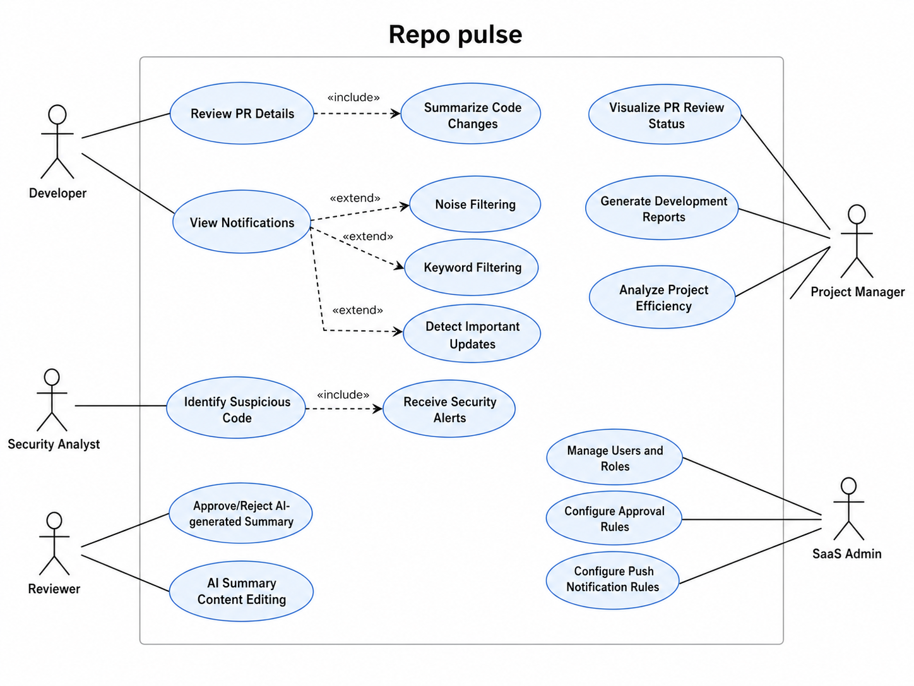

### 参与者

根据提供的功能描述，以下是软件关键的五类参与者：

#### 1. Developer（开发者）
系统的主使用者，进行 PR 审查、查看摘要、提交代码、配置个人过滤规则等。

#### 2. Security Analyst（安全分析员）
专注于识别代码中的潜在安全风险、漏洞和敏感信息，关注高风险事件和安全告警。

#### 3. Project Manager（项目经理）
负责生成项目开发报告、分析项目效率、查看 PR 审查状态等，主要消费看板和报告。

#### 4. Reviewer（审核员）
作为 AI 输出的人工兜底入口，负责审核 AI 生成的 PR 摘要，可以批准、编辑或驳回 AI 结果。

#### 5. SaaS Admin（后台管理员）
负责平台级配置，管理多租户隔离、用户与角色权限、审批规则、推送规则等。

这五类角色串起来就是一条完整的协作闭环 —— Developer 消费信息，Security Analyst 闭环风险，Project Manager 看管理视图，Reviewer 兜底 AI 结果，Admin 做策略配置。

### 用例（Use Cases）

#### 2.1 开发者（Developer）相关功能
- **Review PR Details（审查 PR 详情）**：开发者查看 PR 的详细信息，检查代码改动。
- **Summarize Code Changes（总结代码更改）**：生成 PR 的代码变更摘要，帮助开发者快速理解代码更改。
- **View Notifications（查看通知）**：查看 PR、Issue、Commits 等相关通知。
- **Detect Important Updates（检测重要更新）**：系统自动检测 PR 中的重要更新，并提示开发者关注。
- **Keyword Filtering（关键词过滤）**：开发者设置关键词过滤，只接收自己关心的通知。
- **Noise Filtering（噪音过滤）**：自动忽略不相关的信息，如格式调整、文档更改等。

#### 2.2 安全分析员（Security Analyst）相关功能
- **Identify Suspicious Code（识别可疑代码）**：自动识别代码中的潜在安全问题。
- **Receive Security Alerts（接收安全警告）**：接收系统发送的安全警告，通知安全分析员进行进一步处理。

#### 2.3 项目经理（Project Manager）相关功能
- **Visualize PR Review Status（可视化 PR 审查状态）**：查看 PR 的审查进度，了解各团队成员的工作进展。
- **Generate Development Reports（生成开发报告）**：生成开发团队的进度报告，帮助项目经理做出决策。
- **Analyze Project Efficiency（分析项目效率）**：查看项目的效率、问题解决情况等，帮助改进项目流程。

#### 2.4 审核员（Reviewer）相关功能
- **Approve / Reject AI-generated Summary（批准 / 拒绝 AI 生成的总结）**：审核员对 AI 生成的 PR 摘要、风险评估和语义分类进行批准或拒绝。
- **Content Editing（内容编辑）**：审核员可以修改 AI 生成的内容，如修改风险等级、标签等。

#### 2.5 SaaS 后台管理员（SaaS Admin）相关功能
- **Manage Users and Roles（用户和角色管理）**：管理不同角色（如开发者、审核员、项目经理）的权限。
- **Configure Approval Rules（配置审批规则）**：设置是否启用审批流、配置不同的审核角色。
- **Configure Push Notification Rules（配置推送规则）**：设置哪些事件需要推送，推送给谁。

---

## 数据流图

整条主链路的关键思路是"**同步快通，异步深算**"——API 网关 2 秒内完成入队，AI 分析则走异步队列，最多 30 秒完成，既守住了 GitHub Webhook 的超时约束，又不牺牲 AI 分析的深度。

### 数据流图 0 层

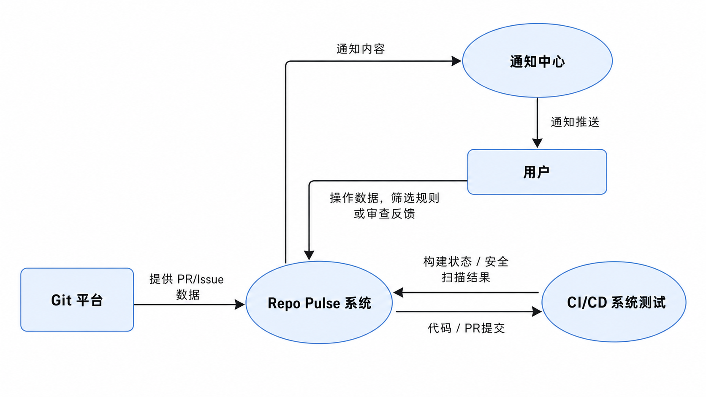

#### 1. Git 平台（如 GitHub / GitLab）
- 提供事件数据，如 PR、Commit、Issue 等，供系统进行处理和分析。

#### 2. 用户
- 通过 UI 与系统交互，提交审查反馈、修改通知设置等，并接收系统推送的通知。

#### 3. CI/CD 系统
- 提供项目代码的构建、测试和部署状态信息，供系统进一步分析。

#### 4. 通知中心（如 Email、钉钉、飞书）
- 接收系统推送的通知数据，并将其转发给最终用户，确保通知及时送达。

### 数据流图 1 层

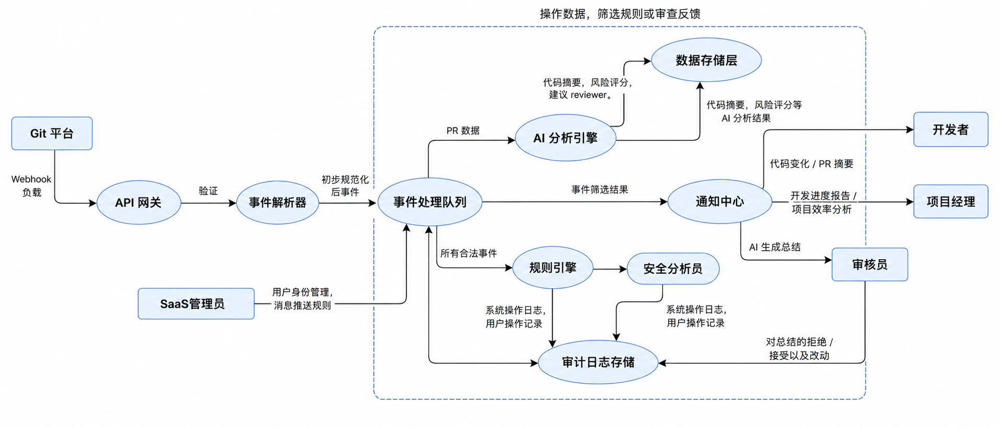

#### 1. API 网关
- 负责验证签名，检查速率限制，并转发 webhook 负载至相关服务。

#### 2. 事件解析器
- 将不同平台的事件格式统一规范化为内部模式。提取元数据、作者信息和变更摘要，便于后续处理。

#### 3. 事件处理队列
- 将待处理的事件排队，按顺序传递给对应的处理引擎进行分析和处理（基于 BullMQ 异步队列实现）。

#### 4. AI 分析引擎
- 对 PR 内容进行详细分析，生成代码摘要、风险评估，并根据代码的复杂性或风险等级推荐合适的审核人。

#### 5. 规则引擎
- 根据用户自定义的规则进行筛选，判断哪些 PR 或 Issue 是高优先级的，哪些可以忽略。该引擎用于决定哪些事件需要通过通知渠道推送给用户。

#### 6. 数据存储层
- 存储系统产生的所有数据，包括 PR 信息、分析结果、用户操作等，提供查询接口供 UI 展示和报告生成使用。

#### 7. 审计日志存储
- 存储系统的操作日志、用户行为、分析结果等信息，确保所有数据操作的可追溯性和合规性。

---

## 类图

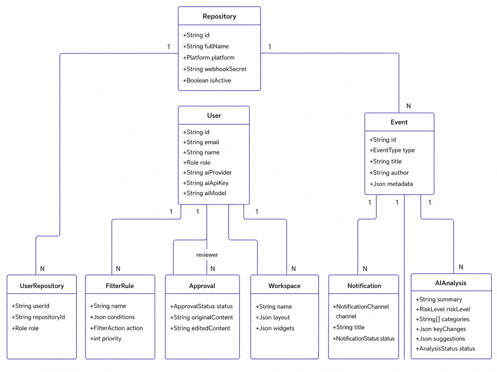

整个数据模型基于 Prisma schema 绘制，以 **User** 为中心：
- 通过 **UserRepository** 与 **Repository** 建立多对多关系。
- **Event** 是数据主干，所有 AI 分析（**AIAnalysis**）、人工审批（**Approval**）、多渠道通知（**Notification**）都围绕 Event 展开。
- **FilterRule** 和 **Workspace** 是用户级的私有配置。
- 所有枚举（如 EventType、RiskLevel、ApprovalStatus、NotificationChannel）均已在代码中落地。

---

## 状态图

我们重点设计了两个状态机：AI 分析任务的生命周期与审批工作流。

### 状态图 1：AI Analysis 生命周期

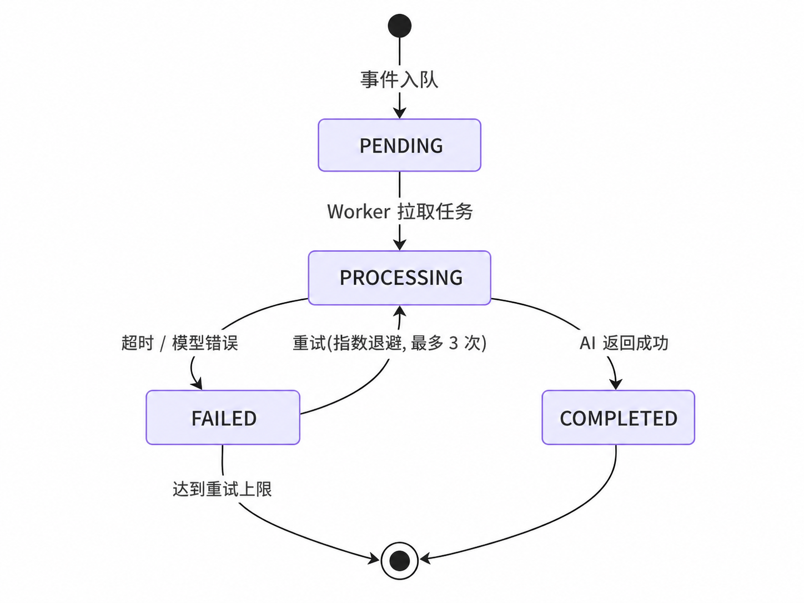

任务从 **PENDING** 进入 **PROCESSING**，完成后进入 **COMPLETED**，失败则进入 **FAILED**。失败任务会按指数退避策略自动重试，最多三次。这个状态机的意义在于，前端可以清楚地告诉用户任务现在卡在哪一步，而不是只有一个模糊的"加载中"。

### 状态图 2：Approval 审批工作流

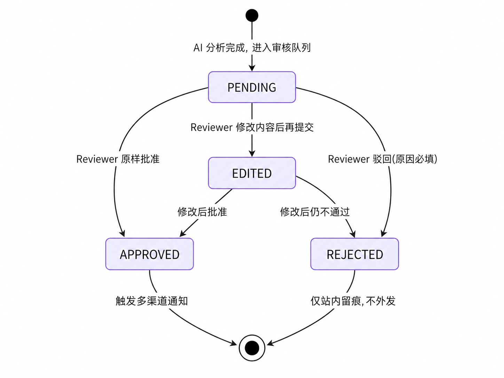

AI 分析结果进入审批队列后是 **PENDING**，Reviewer 可以直接批准、驳回，或者修改后再批准 —— 这就是 **EDITED** 中间态。系统会同时保留 `originalContent` 和 `editedContent` 两份内容，供后续审计追溯。整个流程的关键设计是：**只有 APPROVED 才会触发外部通知**。这样既能发挥 AI 的效率优势，又保留了人工兜底和清晰的责任边界。

---

## CRC Cards

CRC 卡片共 12 张，分为参与者类与系统类两组，涵盖了从信息消费到策略配置的完整协作链条。

### 参与者类

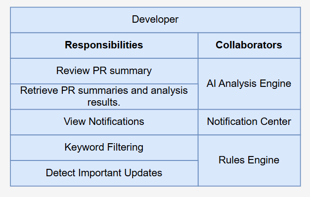

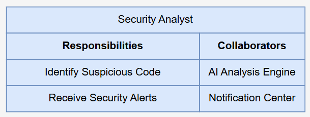

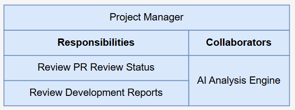

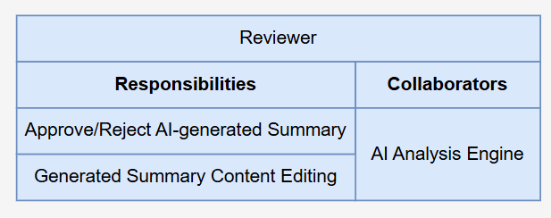

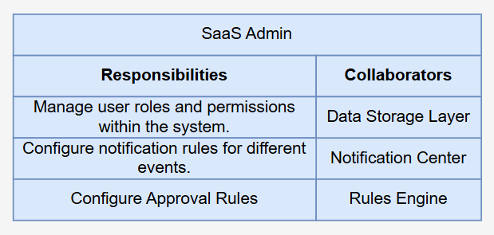

> **Reviewer 设计说明**：Reviewer 不是强制关卡，而是"存疑可查"的入口，只在用户对 AI 结果有疑问时进入手动复核，保证 AI 输出可追溯、可复查、可修正。

### 系统类

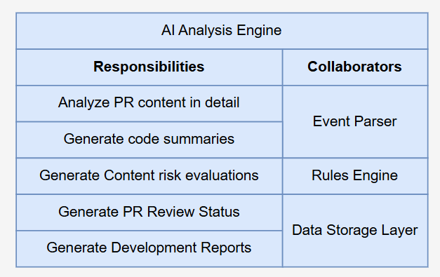

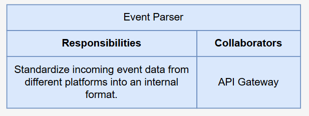

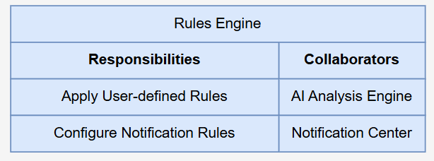

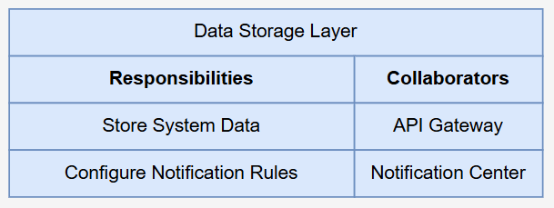

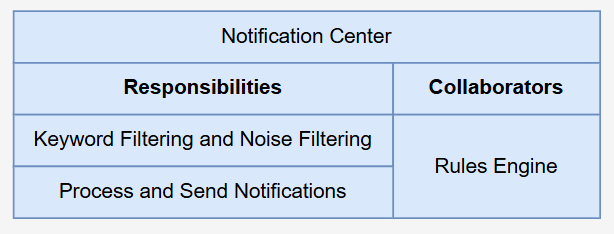

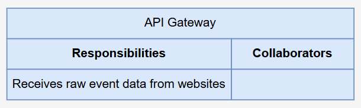

> **系统类分工**：AI Engine 通过 SDK 抽象层适配多家模型；Event Parser 把 GitHub 与 GitLab 的事件格式差异消化在源头；Rules Engine 是"谁该收到什么"的唯一裁判；Notification Center 实现"何时发"和"怎么发"的彻底分离；API 网关把横切的认证、限流、日志关注点从业务模块剥离出来。

---

## 安全性

我们在数据层、接口层、行为层做了三层兜底。

### 1. 数据层

| 维度 | 核心措施 |
| :--- | :--- |
| 凭据存储 | 所有第三方凭证（如 GitHub / GitLab Token）采用 **AES-256** 加密存储，访问时由后端动态解密使用，遵循最小权限原则，Token 不在日志中明文出现 |
| 备份与恢复 | 全量数据每日备份；关键表（用户、权限、审计、安全评分等）启用实时备份 |

### 2. 接口层

| 维度 | 核心措施 |
| :--- | :--- |
| Webhook 完整性 | 使用提供的 Secret 进行 **HMAC-SHA256** 校验，防止伪造回调请求；所有失败校验事件记录审计日志并丢弃 |
| 访问控制 | **RBAC** 四级角色 + 最小权限；敏感操作需双因素验证（2FA）或临时权限验证 |
| 传输安全 | 全站 **HTTPS**；内部服务通信启用 **JWT** 鉴权 |

### 3. 行为层

| 维度 | 核心措施 |
| :--- | :--- |
| Sandbox | AI 分析跑在受限容器，防止恶意代码执行扩散 |
| 审计与应急 | 所有关键操作输出审计日志，满足合规检查需求；建立应急响应 playbook，安全事件自动触发隔离策略 |

### 4. 风险评估与预警
- **实时风险模型**：通过集成历史数据 + ML 模型评分，预测 PR 风险。风险预测结果需在 PR 创建后 20 秒内返回供通知过滤使用。
- **告警管道**：高风险警告通过多渠道推送，支持用户可配规则过滤与分级。
- **静态 & 动态安全扫描**：PR 提交后触发静态代码扫描（OWASP 规则集），输出风险评分；结合依赖库漏洞扫描，自动打标签供安全分析员复核。

---

## 性能

性能围绕三个目标设计：**Webhook 快通、AI 异步、查询快返**。

| 指标类别 | 核心要求 |
| :--- | :--- |
| **Webhook 实时性** | 95% 事件 ≤ 2 秒完成入队与初步分类；CRITICAL 级 ≤ 1 秒触发通知 |
| **AI 摘要生成** | 常规 PR ≤ 10 秒 SSE 流首帧；大 diff（>1K 行）≤ 15 秒，分阶段推送（先发送快速摘要，再补全） |
| **风险评估** | 静态分析 + 风险模型评估 ≤ 30 秒完成初次结果，并以异步补全报告形式推送 |
| **数据库查询** | 单 PR 查询 ≤ 200 ms；批量列表 ≤ 3 秒；写入 ≤ 2 秒 |
| **并发能力** | 同时监控 500 活跃仓库；Webhook 峰值 ≥ 50 QPS；MVP 阶段通过 BullMQ 异步削峰 |
| **可靠性** | NestJS 单体 + BullMQ 异步队列，核心流程幂等；日备份 + 审计表实时备份；RTO ≤ 1 小时，RPO ≤ 15 分钟 |

---

## UI 设计

### 主要页面模块

| 页面 | 路径 | 核心要素 |
| :--- | :--- | :--- |
| Landing | `/` | 产品介绍、登录入口、价值主张展示 |
| Login / AuthCallback | `/login` | GitHub OAuth、HttpOnly Cookie 会话 |
| Dashboard | `/dashboard` | 活跃仓库概览、未审 PR 数、风险趋势、DORA 指标、Recharts 可视化 |
| Repositories | `/repositories` | 仓库绑定、同步状态、Webhook 健康度 |
| AIAnalysis | `/analysis/:id` | 左 diff + 右 AI 摘要 + 风险提示 + Reviewer 推荐 + SSE 流式渲染 |
| Approvals | `/approvals` | 待审批队列、原版 / 编辑版对比、批准 / 驳回 / 编辑操作 |
| Notifications | `/notifications` | 按时间分组、已读 / 忽略、跳转详情 |
| Reports | `/reports` | 周 / 月报生成与查看（P2，MVP 仅占位） |
| Settings | `/settings` | 个人 AI provider 配置、过滤规则、通知偏好、主题切换 |

> **使用路径**：Dashboard 看全局 → 列表看任务 → 详情看证据 → 审批做决策。

### UI 设计原则

- **简洁直观**：每个功能模块单一职责，避免复杂交互。
- **响应式**：桌面 / 平板 / 移动三档适配。
- **语义化色彩**：CRITICAL 红、HIGH 橙、MEDIUM 黄、LOW 蓝，正常态绿。
- **深浅主题**：通过 next-themes 支持两套调色板。

### 视觉规范

- **图表库**：Recharts（趋势图、柱状图、环形图）。
- **动效**：GSAP 承担页面级动画，卡片级用 Tailwind 过渡。
- **组件库**：shadcn/ui + Radix Primitives，30+ 组件全部可访问性达标。
