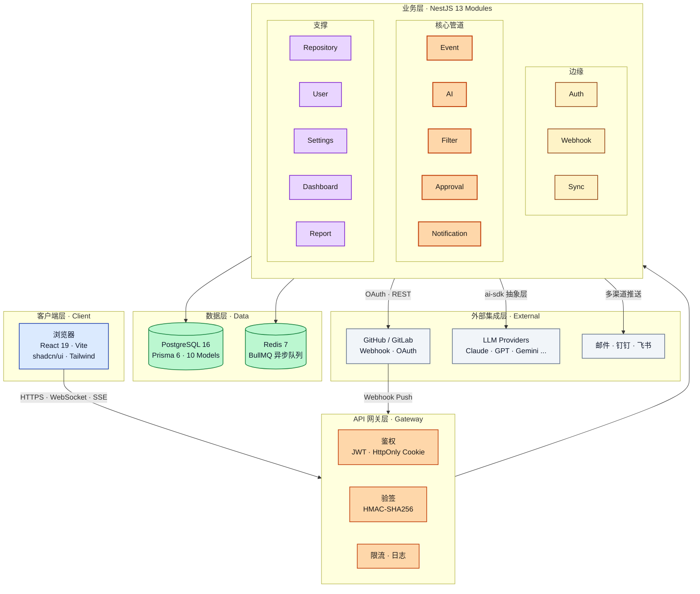

# 1. 分层架构图

> 对应《系统设计书》「系统体系结构图」章节（10 分项核心图）。

Repo Pulse 采用 **5 层架构**，整体设计原则：**同步快通、异步深算、分层解耦**。

- **客户端层**：React 19 + Vite，通过 HTTPS / WebSocket / SSE 与后端通信。
- **API 网关层**：横切关注点（鉴权、签名校验、速率限制）。
- **业务层**：13 个 NestJS 模块按职责拆分为边缘 / 核心 / 支撑三组。
- **数据层**：PostgreSQL 持久化 + Redis 异步队列。
- **外部集成层**：通过 Webhook / OAuth 接 Git 平台，通过 AI SDK 抽象层接多家 LLM。

## 关键说明

| 层 | 关键技术 | 设计要点 |
| :--- | :--- | :--- |
| 客户端 | React 19 + TanStack Query + Zustand + Socket.io-client | 服务端数据走 TanStack Query；实时通信走 WebSocket / SSE |
| API 网关 | NestJS Guards + Passport + `crypto.timingSafeEqual` | 验签必须基于原始 Body；Cookie 只用 HttpOnly |
| 业务层 | NestJS 11 + 依赖注入 + BullMQ Producer / Consumer | Webhook 必须 ≤ 2 秒入队；AI 分析走异步队列 |
| 数据层 | PostgreSQL 16 + Prisma 6；Redis 7 + BullMQ | 关键查询带复合索引；队列幂等去重 |
| 外部集成 | `@repo-pulse/ai-sdk` 抽象层 | 一键切换 7+ 家 LLM Provider |
