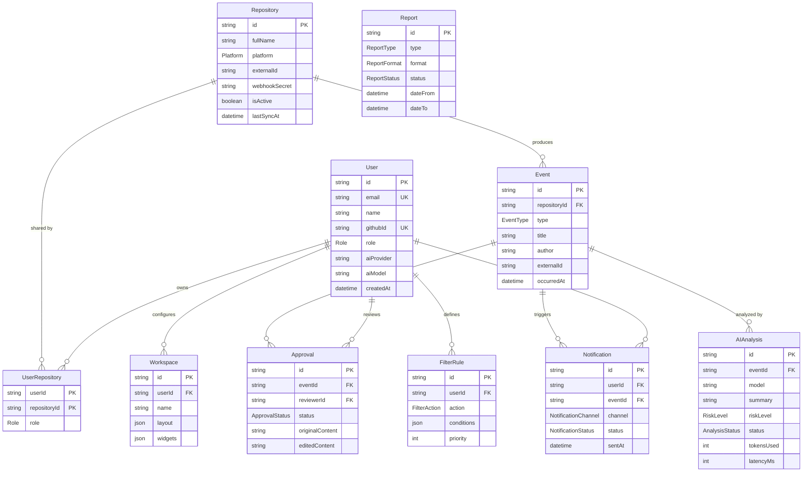

# 2. E-R 图（实体关系图）

> 对应《系统设计书》「数据库设计」章节（20 分项核心图）。

数据模型基于 `packages/database/prisma/schema.prisma`，共 **10 个 Model + 12 个枚举**。建模以 **User 为中心、Event 为主干**：

- **User ↔ Repository**：多对多，通过 `UserRepository` 显式关联表实现。
- **Event**：所有事件主干，串联 AI 分析、人工审批、多渠道通知。
- **FilterRule / Workspace**：用户级私有配置。
- **Report**：跨仓库聚合，独立存在。

## 关键索引设计

| 表 | 索引 | 用途 |
| :--- | :--- | :--- |
| `Event` | `(repositoryId, createdAt)`、`(type, createdAt)`、`(repositoryId, occurredAt)`、`(type, occurredAt)` | 仓库视图分页、按类型筛选、时间线倒排 |
| `AIAnalysis` | `(eventId)`、`(status)` | Event 详情页查 AI 结果；Worker 拉取 PENDING 任务 |
| `Approval` | `(status, createdAt)` | 审批队列分页 |
| `Notification` | `(userId, createdAt)`、`(status)` | 个人通知中心；重试失败任务 |
| `Repository` | `unique(platform, externalId)` | 同一外部仓库不重复绑定 |
| `User` | `unique(email)`、`unique(githubId)`、`unique(gitlabId)` | 登录与 OAuth 绑定 |

## 枚举清单（12 个）

`Role` · `Platform` · `EventType` · `RiskLevel` · `AnalysisStatus` · `FilterAction` · `ApprovalStatus` · `NotificationChannel` · `NotificationStatus` · `ReportType` · `ReportFormat` · `ReportStatus`

## 设计要点

| 维度 | 说明 |
| :--- | :--- |
| **建模中心** | `User` 是访问主语，`Event` 是数据主干，所有 AI 分析 / 审批 / 通知都挂在 Event 上 |
| **多对多关系** | `User ↔ Repository` 通过 `UserRepository` 显式关联表，便于扩展 `Role` 字段 |
| **审计双版本** | `Approval` 同时保留 `originalContent` 与 `editedContent`，满足审计追溯 |
| **加密字段** | `User.aiApiKey`、`Repository.webhookSecret` 应用层 AES-256 加密落库 |
| **JSON 列** | `FilterRule.conditions`、`Workspace.layout` 等用 JSON 支持灵活配置 |
