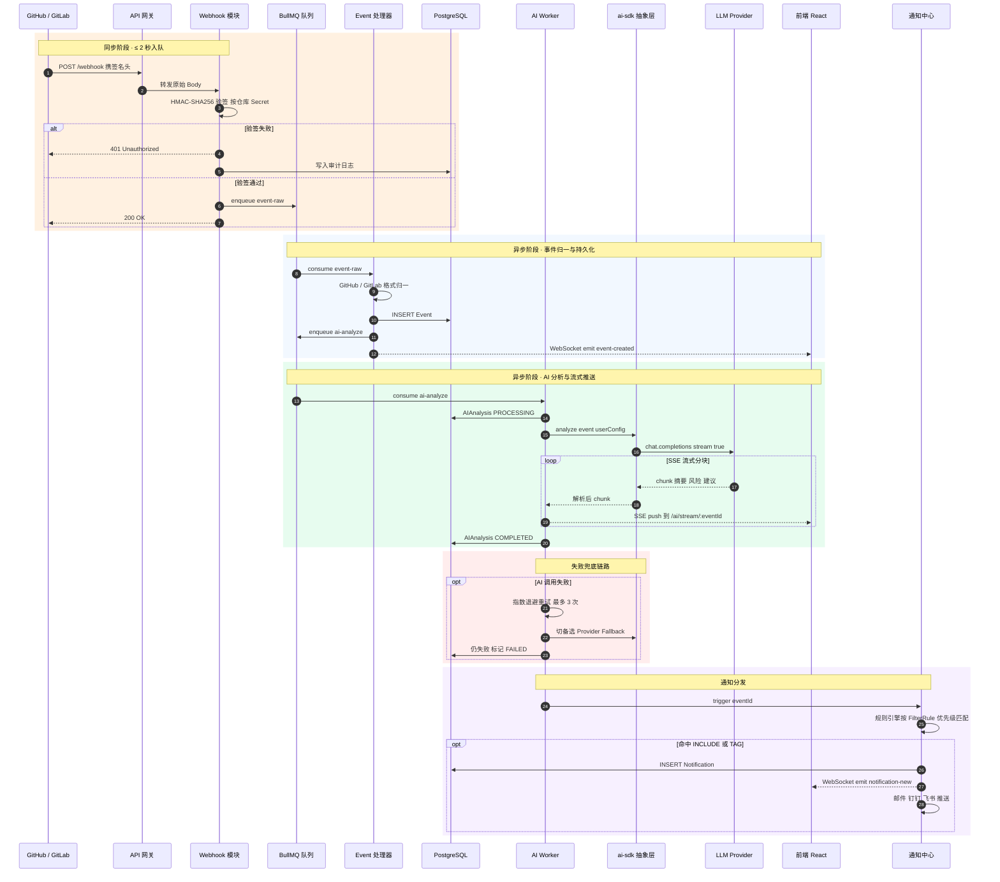

# 3. 核心流程时序图：Webhook → AI 分析 → SSE 推送

> 对应《系统设计书》「关键过程描述」章节（15 分项核心图）。

这是 Repo Pulse 的主链路。设计原则是 **"同步快通，异步深算"** —— 网关必须在 2 秒内完成入队并返回 200，AI 分析则走异步队列，最多 30 秒完成。

## 关键性能约束

| 阶段 | SLA |
| :--- | :--- |
| 网关入队（步骤 1–6） | **≤ 2 秒** (P95) |
| CRITICAL 级通知首次触发 | **≤ 1 秒** |
| AI 摘要 SSE 首帧 | **≤ 10 秒**（常规 PR） |
| 大 diff（>1K 行）AI 完成 | **≤ 15 秒**，分阶段推送 |
| AI 任务最大重试 | **3 次**，指数退避（1s / 4s / 16s） |

## 关联状态机

- **AI 分析任务**：`PENDING → PROCESSING → COMPLETED / FAILED`（见 `srs.md` 状态图 1）
- **审批工作流**：`PENDING → EDITED / APPROVED / REJECTED`（见 `srs.md` 状态图 2）
- **通知投递**：`PENDING → SENT / FAILED → READ`
