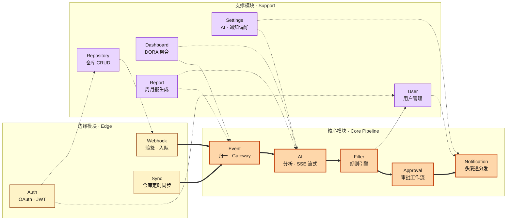
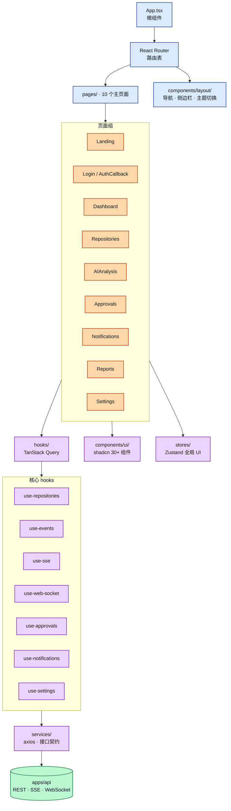

# 4. 组件图 / 模块依赖图

> 对应《系统设计书》「组件设计 / 详细设计」章节（20 分项核心图）。

后端共 **13 个 NestJS 模块**，按职责分为三组：

- **边缘模块**：处理外部输入（OAuth 回调、Webhook 推送、定时同步）。
- **核心模块**：主链路 Event → AI → Filter → Approval → Notification。
- **支撑模块**：跨切面能力（仓库管理、用户管理、配置、看板、报告）。

## 后端模块依赖图

**图例**：粗实箭头 `==>` 表示主链路数据流；虚箭头 `-.->` 表示依赖关系。

## 模块职责说明

### 边缘模块

| 模块 | 主要职责 | 关键文件 |
| :--- | :--- | :--- |
| **Auth** | GitHub OAuth 登录、JWT 签发、HttpOnly Cookie 写入、Guards | `auth.controller.ts`, `strategies/`, `guards/` |
| **Webhook** | Raw Body HMAC-SHA256 验签、按仓库 Secret 查找、入 BullMQ 队列 | `webhook.controller.ts`, `webhook.service.ts` |
| **Sync** | 定时拉取仓库元数据、Webhook 健康检查 | `sync.service.ts` |

### 核心模块

| 模块 | 主要职责 | 关键文件 |
| :--- | :--- | :--- |
| **Event** | GitHub / GitLab 格式归一、Event 持久化、WebSocket Gateway 广播 | `event.processor.ts`, `event.gateway.ts` |
| **AI** | AI 任务队列消费、调用 `@repo-pulse/ai-sdk`、SSE 流式输出、结果落库 | `ai-analysis.processor.ts`, `ai.controller.ts` |
| **Filter** | INCLUDE / EXCLUDE / TAG 规则匹配、按优先级裁决通知去向 | `filter.service.ts` |
| **Approval** | 审批队列、编辑双版本保留（originalContent / editedContent）、状态机驱动 | `approval.service.ts` |
| **Notification** | 邮件 / 钉钉 / 飞书 / 站内信适配器、失败重试、已读追踪 | `channels/`, `notification.service.ts` |

### 支撑模块

| 模块 | 主要职责 |
| :--- | :--- |
| **Repository** | 仓库绑定、Webhook 注册、`UserRepository` 关联管理 |
| **User** | 用户 CRUD、角色管理 |
| **Settings** | 个人 AI Provider 配置（加密存储）、通知偏好、主题 |
| **Dashboard** | DORA 4 指标聚合查询、风险趋势统计 |
| **Report** | 周 / 月报模板渲染、跨仓库聚合（P2 阶段） |

## 前端组件层次

## 共享包

| 包 | 职责 |
| :--- | :--- |
| `@repo-pulse/shared` | 前后端共享的 TypeScript 类型、常量、Payload 接口 |
| `@repo-pulse/database` | Prisma Schema + 客户端 |
| `@repo-pulse/ai-sdk` | 多 Provider 抽象层（统一 `chat()` / `stream()` 接口） |
