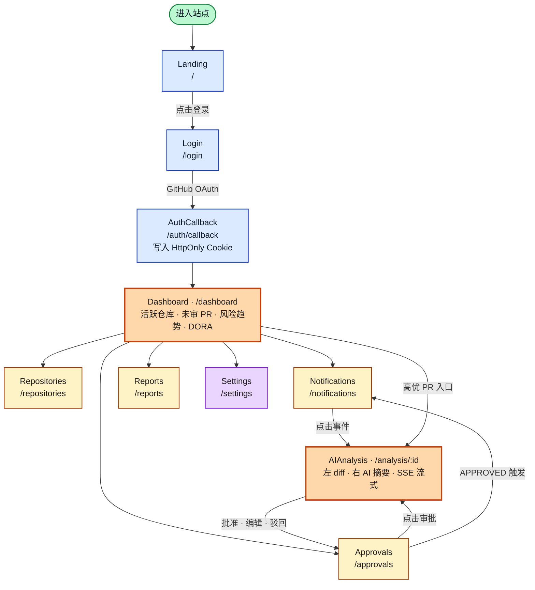
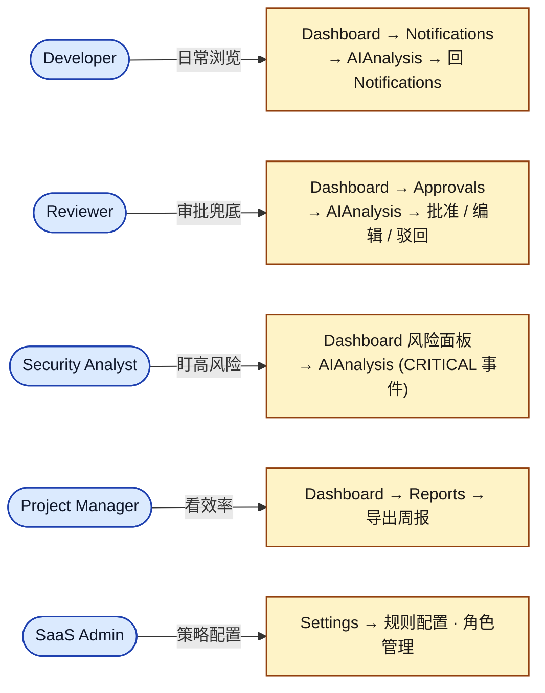

# 5. 页面流程图（User Flow）

> 对应《系统设计书》「用户界面设计」章节（10 分项关键图）。

前端共 **10 个主页面**，使用路径概括为：**Dashboard 看全局 → 列表看任务 → 详情看证据 → 审批做决策**。

## 页面与路径对照表

| 页面 | 路径 | 角色入口 | 核心要素 |
| :--- | :--- | :--- | :--- |
| Landing | `/` | 全部 | 产品介绍、登录入口、价值主张展示 |
| Login | `/login` | 未登录 | GitHub OAuth 登录按钮 |
| AuthCallback | `/auth/callback` | 未登录 | OAuth 回调处理、HttpOnly Cookie 写入 |
| **Dashboard** | `/dashboard` | 全部 | 活跃仓库概览、未审 PR、风险趋势、DORA 指标、Recharts 可视化 |
| Repositories | `/repositories` | Developer / Admin | 仓库绑定、同步状态、Webhook 健康度 |
| **AIAnalysis** | `/analysis/:id` | Developer / Reviewer | 左 diff + 右 AI 摘要 + 风险提示 + Reviewer 推荐 + SSE 流式渲染 |
| **Approvals** | `/approvals` | Reviewer | 待审批队列、原版 / 编辑版对比、批准 / 驳回 / 编辑操作 |
| Notifications | `/notifications` | 全部 | 按时间分组、已读 / 忽略、跳转详情 |
| Reports | `/reports` | Project Manager | 周 / 月报生成与查看（P2 阶段） |
| Settings | `/settings` | 全部 | 个人 AI Provider 配置、过滤规则、通知偏好、主题切换 |

## 角色使用路径

## 设计原则

| 原则 | 落地方式 |
| :--- | :--- |
| 简洁直观 | 每个页面单一职责，主操作不超过 3 个 |
| 响应式适配 | 桌面 / 平板 / 移动三档断点 |
| 语义化色彩 | CRITICAL 红 · HIGH 橙 · MEDIUM 黄 · LOW 蓝 · 正常态绿 |
| 深浅主题 | 通过 `next-themes` 切换两套调色板 |
