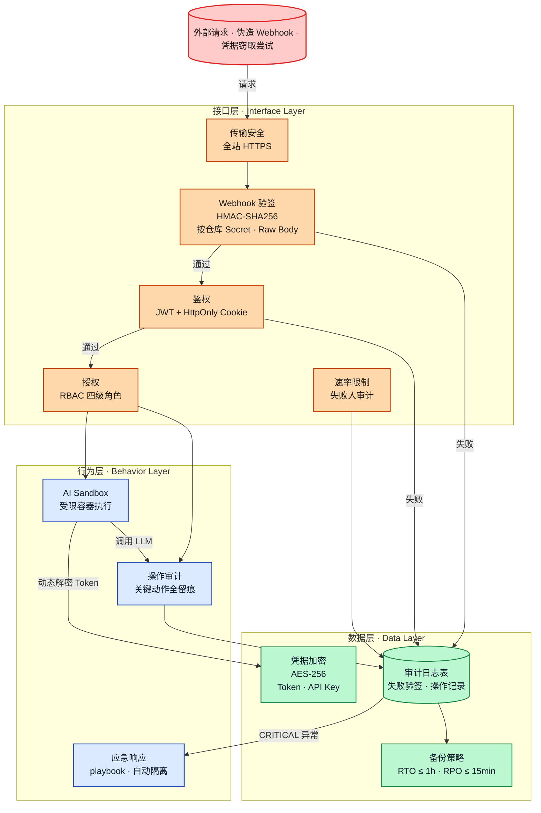
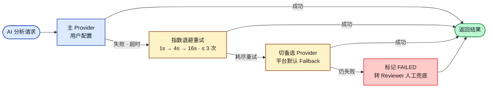

# 6. 安全架构图

> 对应《系统设计书》「可靠性 & 安全性设计」章节（10 分项关键图）。

Repo Pulse 采用 **三层兜底安全模型**：数据层加密、接口层校验、行为层审计。

## 三层安全架构

## 三层安全措施对照

| 层 | 维度 | 核心措施 |
| :--- | :--- | :--- |
| **数据层** | 凭据存储 | 所有第三方凭证（GitHub / GitLab Token、AI API Key）采用 **AES-256** 加密落库，动态解密使用，日志不出明文 |
| | 备份恢复 | 全量数据每日备份；用户 / 权限 / 审计 / 安全评分等关键表启用实时备份；**RTO ≤ 1h · RPO ≤ 15min** |
| **接口层** | Webhook 完整性 | 基于 **原始 Body** 做 **HMAC-SHA256** 校验；按仓库粒度获取 Secret；失败入审计后丢弃 |
| | 鉴权 | JWT 存于 **HttpOnly Cookie**（前端不可读，防 XSS）；过期自动刷新 |
| | 授权 | **RBAC 四级**：ADMIN / MANAGER / MEMBER / VIEWER；敏感操作 2FA |
| | 传输安全 | 全站 **HTTPS**；内部服务通信启用 JWT 鉴权 |
| **行为层** | AI 执行隔离 | AI 分析跑在受限容器（Sandbox），防止恶意 Prompt / 代码扩散主流程 |
| | 审计 & 应急 | 所有关键操作（登录、Webhook 失败、AI 调用、审批动作）写入 `AuditLog`；CRITICAL 级异常 5 分钟内通知负责人，自动触发隔离策略 |

## 容错与降级链路

## 可靠性指标（SLO）

| 维度 | 目标 |
| :--- | :--- |
| Webhook 入队 | 95% 事件 ≤ 2 秒 |
| CRITICAL 级通知 | ≤ 1 秒触发 |
| AI 摘要首帧 | 常规 PR ≤ 10 秒；大 diff ≤ 15 秒 |
| 单 PR 查询 | ≤ 200 ms |
| 灾难恢复 | RTO ≤ 1 小时；RPO ≤ 15 分钟 |
| AI 任务重试 | 最多 3 次，超过转人工 |
