# Repo-Pulse 系统设计书

## 目录

1. [系统体系结构](#1-系统体系结构)
2. [数据库设计](#2-数据库设计)
3. [关键过程描述](#3-关键过程描述)
4. [用户界面设计](#4-用户界面设计)
5. [组件设计 / 详细设计](#5-组件设计--详细设计)
6. [可靠性与安全性设计](#6-可靠性与安全性设计)
7. [项目文档体系](#7-项目文档体系)
8. [术语与缩写表](#术语与缩写表)

---

## 项目概述

Repo-Pulse 是一个基于大语言模型的 SaaS 化研发效能与智能治理平台。系统通过深度整合 Git 工作流，把海量底层 Git 事件转化为高价值语义信息，帮助开发者从信息过载中解脱，并为管理者提供量化的工程质量视图。

- 业务目标：替换"人工 Code Review + 多群通知"的传统模式，用 AI 摘要与智能分发降低研发协作成本。
- 核心能力：多源数据集成、AI 智能研判、智能过滤与审批、研发效能看板（DORA）、多渠道通知。
- 技术形态：Monorepo（apps/web + apps/api + packages/*），Docker Compose 一键启动。

---

## 1. 系统体系结构

### 1.1 总体架构

Repo-Pulse 采用五层解耦架构，整体设计原则为：同步快通、异步深算、分层解耦。

### 1.2 分层职责

| 层 | 关键组件 | 主要职责 |
| :--- | :--- | :--- |
| 客户端层 | 浏览器（React 19 · Vite · shadcn/ui · Tailwind） | UI 渲染、TanStack Query 服务端状态、Zustand 全局 UI 状态、Socket.io / SSE 实时通信 |
| API 网关层 | NestJS Guards · Passport · `crypto.timingSafeEqual` | JWT 鉴权（HttpOnly Cookie）、Webhook HMAC-SHA256 验签、限流与请求日志 |
| 业务层 | 13 个 NestJS 模块（边缘 3 + 核心 5 + 支撑 5） | 业务编排，模块间依赖注入 |
| 数据层 | PostgreSQL 16 + Prisma 6；Redis 7 + BullMQ | 关键查询带复合索引；BullMQ 实现 Webhook 异步削峰 |
| 外部集成层 | GitHub / GitLab Webhook 与 OAuth；LLM Providers；邮件 / 钉钉 / 飞书 | 通过 `@repo-pulse/ai-sdk` 抽象层一键切换多家 LLM |

### 1.3 业务层模块分组

| 组 | 模块 | 说明 |
| :--- | :--- | :--- |
| 边缘 | Auth · Webhook · Sync | 处理外部输入与定时任务 |
| 核心管道 | Event · AI · Filter · Approval · Notification | 串联主链路：事件归一 → AI 分析 → 规则过滤 → 人工审批 → 多渠道分发 |
| 支撑 | Repository · User · Settings · Dashboard · Report | 仓库、用户、配置、看板、报告 |

### 1.4 设计原则

- 同步快通：API 网关须在 2 秒内完成 Webhook 入队并返回 200，避免 GitHub 默认 10 秒超时。
- 异步深算：所有耗时操作（AI 调用、通知推送、报告生成）通过 BullMQ 异步队列处理。
- 抽象解耦：AI 多 Provider、通知多渠道、数据库分别通过抽象层解耦，便于替换实现。
- 横切剥离：鉴权、验签、限流、日志全部在网关层完成，业务模块不感知。

### 1.5 架构示意图

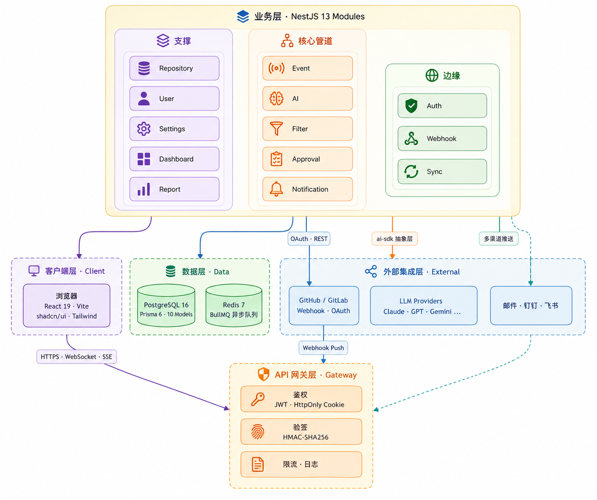

<p align="center">图 1-1 · 分层架构示意图（5 层 13 模块）</p>

---

## 2. 数据库设计

### 2.1 设计思路

数据模型基于 `packages/database/prisma/schema.prisma`，共 10 个 Model 与 12 个枚举。建模以 User 为中心、Event 为主干：

- `User` 与 `Repository` 通过显式关联表 `UserRepository` 建立多对多关系，便于扩展 `Role` 字段。
- `Event` 是数据主干，所有 AI 分析、人工审批、多渠道通知都挂在 Event 上。
- `FilterRule` 与 `Workspace` 是用户私有配置。
- `Report` 跨仓库聚合，独立存在。

### 2.2 实体清单

| 实体 | 主键 | 关键字段 | 关系 |
| :--- | :--- | :--- | :--- |
| User | `id` | `email` UK、`githubId` UK、`role`、`aiProvider`、`aiApiKey`（加密） | 1:N → Approval / Notification / Workspace / FilterRule |
| Repository | `id` | `fullName`、`platform`、`externalId`、`webhookSecret`（加密） | 1:N → Event |
| UserRepository | `(userId, repositoryId)` | `role` | 关联 User 与 Repository |
| Event | `id` | `repositoryId`、`type`、`title`、`author`、`externalId`、`occurredAt` | 1:N → AIAnalysis / Approval / Notification |
| AIAnalysis | `id` | `eventId`、`model`、`summary`、`riskLevel`、`status`、`tokensUsed` | N:1 → Event |
| Approval | `id` | `eventId`、`reviewerId`、`status`、`originalContent`、`editedContent` | N:1 → Event / User |
| Notification | `id` | `userId`、`eventId`、`channel`、`status`、`sentAt` | N:1 → User / Event |
| FilterRule | `id` | `userId`、`action`（INCLUDE / EXCLUDE / TAG）、`conditions` JSON、`priority` | N:1 → User |
| Workspace | `id` | `userId`、`name`、`layout` JSON、`widgets` JSON | N:1 → User |
| Report | `id` | `type`、`format`、`status`、`dateFrom`、`dateTo` | 独立 |

### 2.3 枚举清单

`Role` · `Platform` · `EventType` · `RiskLevel` · `AnalysisStatus` · `FilterAction` · `ApprovalStatus` · `NotificationChannel` · `NotificationStatus` · `ReportType` · `ReportFormat` · `ReportStatus`

### 2.4 关键索引设计

| 表 | 索引 | 用途 |
| :--- | :--- | :--- |
| `Event` | `(repositoryId, createdAt)`、`(type, createdAt)`、`(repositoryId, occurredAt)`、`(type, occurredAt)` | 仓库视图分页、按类型筛选、时间线倒排 |
| `AIAnalysis` | `(eventId)`、`(status)` | Event 详情页查 AI 结果；Worker 拉取 PENDING 任务 |
| `Approval` | `(status, createdAt)` | 审批队列分页 |
| `Notification` | `(userId, createdAt)`、`(status)` | 个人通知中心；重试失败任务 |
| `Repository` | `unique(platform, externalId)` | 同一外部仓库不重复绑定 |
| `User` | `unique(email)`、`unique(githubId)`、`unique(gitlabId)` | 登录与 OAuth 绑定 |

### 2.5 数据安全约束

- 第三方凭证（GitHub / GitLab Token、AI API Key）应用层 AES-256 加密落库，运行时动态解密。
- JSON 字段（`FilterRule.conditions`、`Workspace.layout`）配合 TypeScript 类型在 `@repo-pulse/shared` 中定义，避免 schema-less 漂移。
- 所有外键 `onDelete: Cascade`，仅 `Approval.reviewerId` 例外，以保留审计回溯。

### 2.6 E-R 示意图

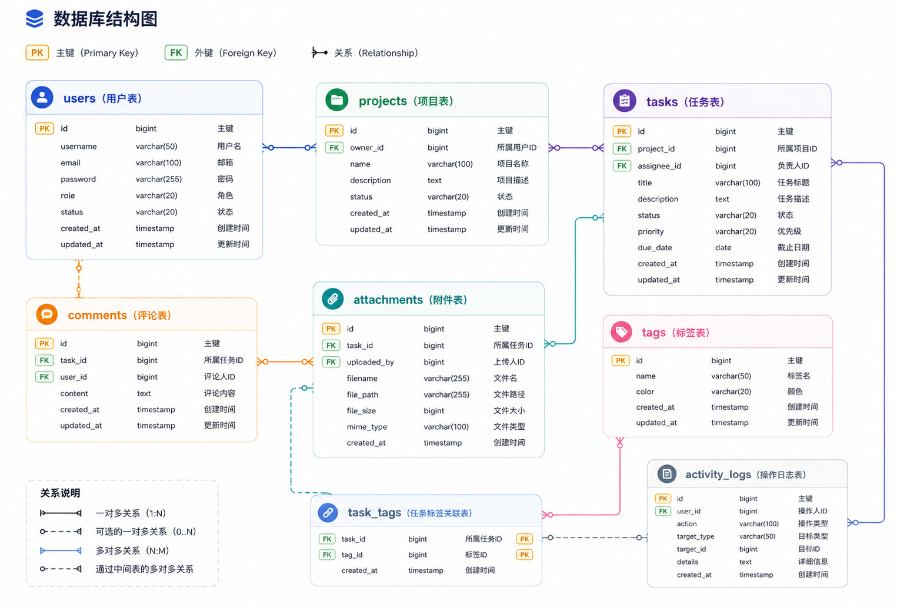

<p align="center">图 2-1 · E-R 示意图（基于 Prisma schema）</p>

---

## 3. 关键过程描述

主链路体现"同步快通、异步深算"原则，从外部 Webhook 到最终通知共分四个阶段：入队、归一、AI 流式、审批与分发。

### 3.1 阶段 1：同步入队

| 步骤 | 模块 | 动作 |
| :--- | :--- | :--- |
| 1 | GitHub / GitLab | 通过 Webhook POST 推送事件（带 `X-Hub-Signature-256` 头） |
| 2 | API 网关 | 转发原始 Body 至 Webhook 模块 |
| 3 | Webhook 模块 | 基于 Raw Body 做 HMAC-SHA256 验签，按仓库粒度获取 Secret |
| 4 | Webhook 模块 | 验签通过则 `BullMQ.add('event-raw', payload)`；失败则 401 + 审计日志 |
| 5 | API 网关 | 返回 200 OK（≤ 2 秒，满足 GitHub 超时约束） |

### 3.2 阶段 2：异步归一与持久化

| 步骤 | 模块 | 动作 |
| :--- | :--- | :--- |
| 6 | Event Processor | 消费 `event-raw`，把 GitHub / GitLab 不同格式归一到内部 schema |
| 7 | Event Processor | `INSERT Event` 持久化（写 PostgreSQL） |
| 8 | Event Processor | `BullMQ.add('ai-analyze', eventId)`，触发下游 AI 分析 |
| 9 | Event Gateway | WebSocket emit `event:created`，前端即时更新 |

### 3.3 阶段 3：AI 流式分析

| 步骤 | 模块 | 动作 |
| :--- | :--- | :--- |
| 10 | AI Worker | 消费 `ai-analyze`，`UPDATE AIAnalysis SET status='PROCESSING'` |
| 11 | ai-sdk 抽象层 | 调用用户配置的 LLM Provider，`stream=true` |
| 12 | LLM Provider | 流式回传摘要、风险、建议 |
| 13 | AI Worker | 每个 chunk 解析后通过 SSE 推送到前端 `/ai/stream/:eventId` |
| 14 | AI Worker | 流结束后 `UPDATE AIAnalysis SET status='COMPLETED'` 并落库摘要 |

失败兜底：若 LLM 调用超时或返回异常，先指数退避重试（1s → 4s → 16s，最多 3 次）；重试耗尽后切换备选 Provider；仍失败则标记 `FAILED` 并由 Reviewer 人工兜底。

### 3.4 阶段 4：审批与多渠道分发

| 步骤 | 模块 | 动作 |
| :--- | :--- | :--- |
| 15 | AI Worker | 触发 Notification 模块 |
| 16 | Filter Engine | 按 `FilterRule.priority` 优先级匹配 INCLUDE / EXCLUDE / TAG 规则 |
| 17 | Approval | 命中 TAG 或 INCLUDE 且需审批的事件进入 `ApprovalStatus = PENDING`；状态机 `PENDING → EDITED / APPROVED / REJECTED` |
| 18 | Notification | `APPROVED` 后写入 `Notification` 表，通过邮件 / 钉钉 / 飞书 / 站内信适配器分发 |
| 19 | Event Gateway | WebSocket emit `notification:new`，前端弹出通知 |

### 3.5 状态机

- AIAnalysis：`PENDING → PROCESSING → COMPLETED / FAILED`
- Approval：`PENDING → EDITED / APPROVED / REJECTED`，EDITED 保留 `originalContent` 与 `editedContent` 双版本供审计
- Notification：`PENDING → SENT / FAILED → READ`

### 3.6 时序示意图

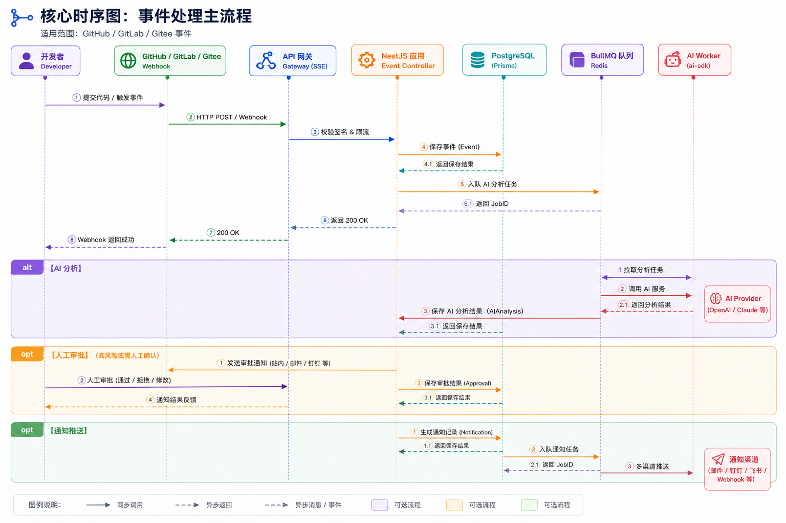

<p align="center">图 3-1 · 主链路时序示意图</p>

---

## 4. 用户界面设计

### 4.1 页面流程图

前端共 10 个主页面，使用路径概括为：Dashboard 看全局 → 列表看任务 → 详情看证据 → 审批做决策。

### 4.2 页面与路径对照

| 页面 | 路径 | 角色入口 | 核心要素 |
| :--- | :--- | :--- | :--- |
| Landing | `/` | 全部 | 产品介绍、登录入口、价值主张展示 |
| Login | `/login` | 未登录 | GitHub OAuth 登录按钮 |
| AuthCallback | `/auth/callback` | 未登录 | OAuth 回调处理、HttpOnly Cookie 写入 |
| Dashboard | `/dashboard` | 全部 | 活跃仓库概览、未审 PR、风险趋势、DORA 指标、Recharts 可视化 |
| Repositories | `/repositories` | Developer / Admin | 仓库绑定、同步状态、Webhook 健康度 |
| AIAnalysis | `/analysis/:id` | Developer / Reviewer | 左 diff + 右 AI 摘要 + 风险提示 + Reviewer 推荐 + SSE 流式渲染 |
| Approvals | `/approvals` | Reviewer | 待审批队列、原版 / 编辑版对比、批准 / 驳回 / 编辑 |
| Notifications | `/notifications` | 全部 | 按时间分组、已读 / 忽略、跳转详情 |
| Reports | `/reports` | Project Manager | 周 / 月报生成与查看（P2 阶段） |
| Settings | `/settings` | 全部 | 个人 AI Provider 配置、过滤规则、通知偏好、主题切换 |

### 4.3 落地实现

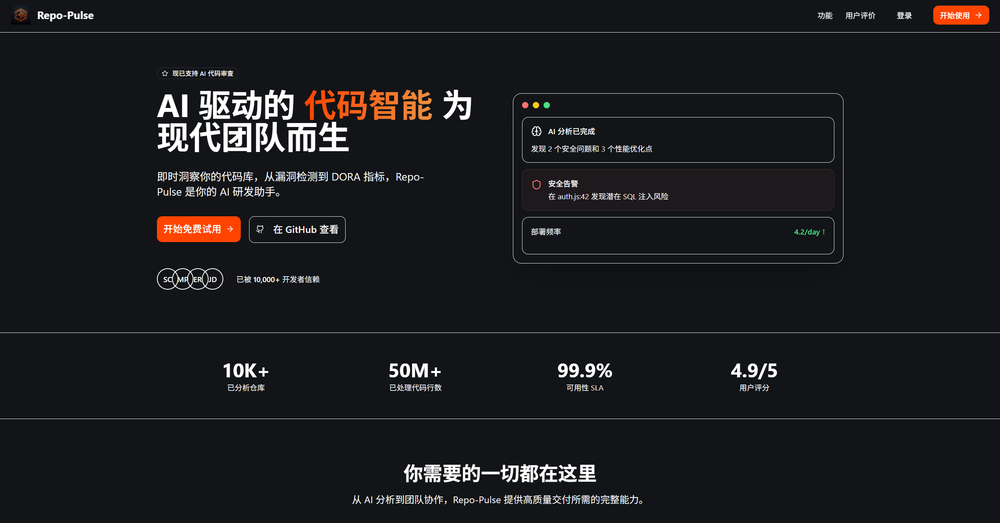

<p align="center">图 4-1 · Landing 页面（产品价值主张展示）</p>

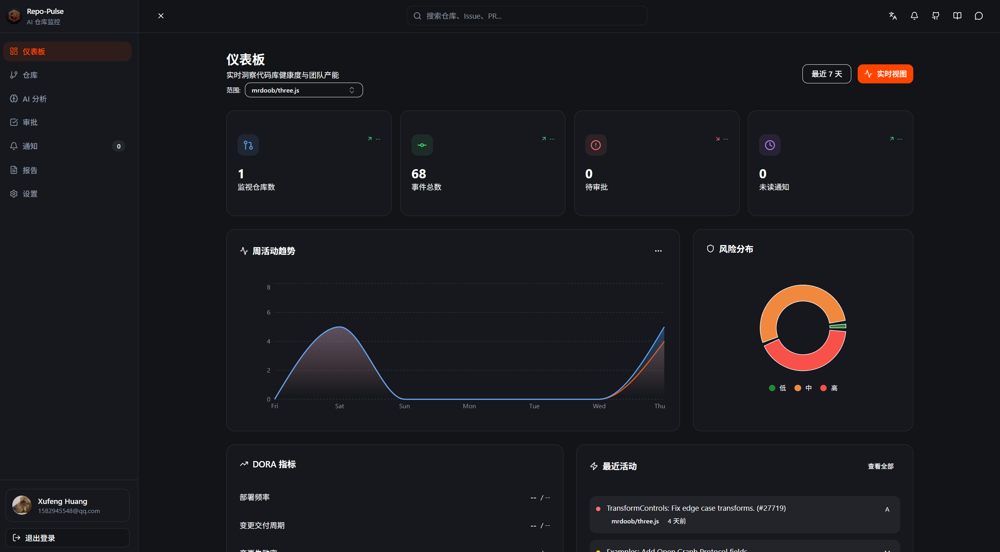

<p align="center">图 4-2 · Dashboard 页面（DORA 指标、趋势图、风险分布）</p>

### 4.4 设计原则

| 原则 | 落地方式 |
| :--- | :--- |
| 简洁直观 | 每个页面单一职责，主操作不超过 3 个 |
| 响应式适配 | 桌面 / 平板 / 移动三档断点（基于 Tailwind） |
| 语义化色彩 | CRITICAL 红、HIGH 橙、MEDIUM 黄、LOW 蓝、正常态绿 |
| 深浅主题 | 通过 `next-themes` 切换两套调色板 |
| 组件复用 | shadcn/ui 与 Radix Primitives，30+ 组件全部可访问性达标 |

### 4.5 关键交互

- AIAnalysis 双栏：左侧 diff 视图（折叠 unchanged 块），右侧 SSE 流式渲染 AI 摘要、风险、Reviewer 推荐。
- Approvals 对比：批准前并排显示 `originalContent` 与 `editedContent`，差异高亮。
- Notifications 分组：按"今日 / 昨日 / 上周"分组，支持关键词与噪音过滤。

### 4.6 页面流程示意图

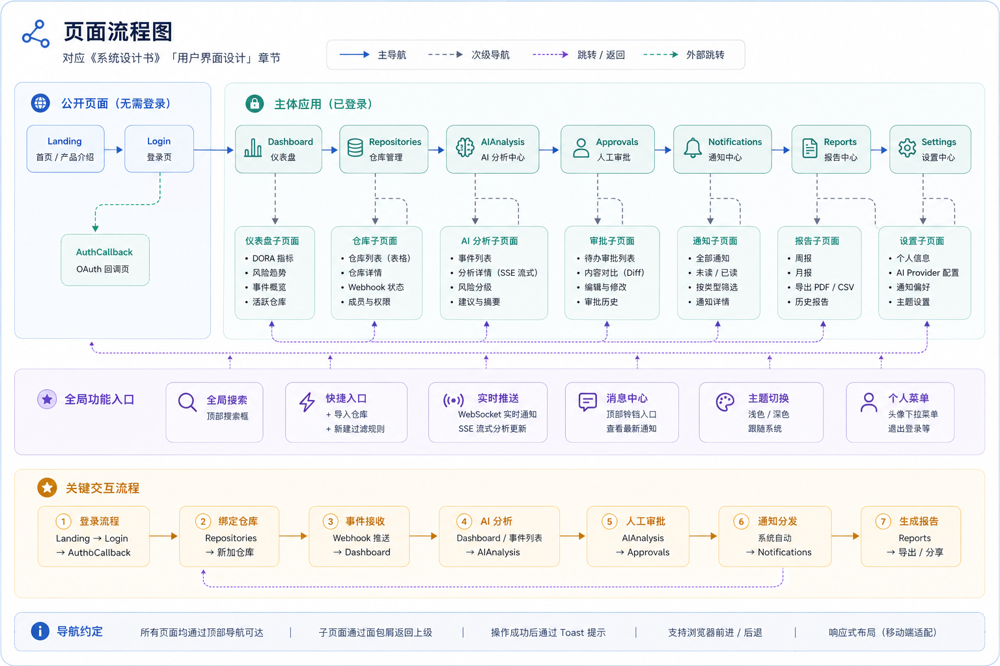

<p align="center">图 4-3 · 页面流程示意图</p>

### 4.7 角色使用路径

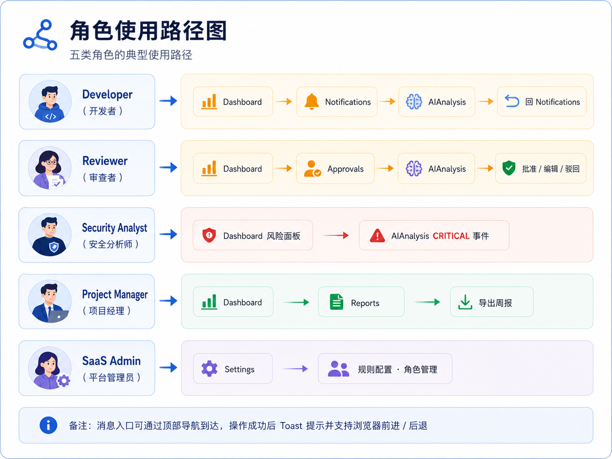

<p align="center">图 4-4 · 五类角色的典型使用路径</p>

---

## 5. 组件设计 / 详细设计

### 5.1 总组件图

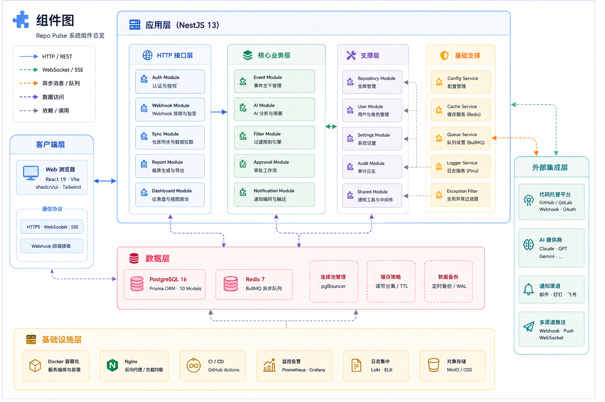

<p align="center">图 5-1 · 总组件图（接入层 · 核心业务层 · 支撑层 · 基础设施层）</p>

### 5.2 后端模块详细设计

#### 边缘模块

| 模块 | 职责 | 关键文件 | 对外接口 |
| :--- | :--- | :--- | :--- |
| Auth | GitHub OAuth、JWT 签发、HttpOnly Cookie、Guards | `auth.controller.ts`、`strategies/`、`guards/`、`decorators/` | `GET /auth/github`、`GET /auth/callback`、`POST /auth/logout` |
| Webhook | Raw Body HMAC-SHA256 验签、入 BullMQ 队列 | `webhook.controller.ts`、`webhook.service.ts` | `POST /webhook/:platform` |
| Sync | 定时拉取仓库元数据、Webhook 健康检查 | `sync.service.ts` | 内部 Cron Job |

#### 核心模块

| 模块 | 职责 | 关键文件 | 对外接口 |
| :--- | :--- | :--- | :--- |
| Event | 平台格式归一、Event 持久化、WebSocket Gateway 广播 | `event.processor.ts`、`event.gateway.ts`、`event.service.ts` | `GET /events`、`GET /events/:id`；WS `event:created` |
| AI | 队列消费、调用 `@repo-pulse/ai-sdk`、SSE 流式输出、结果落库 | `ai-analysis.processor.ts`、`ai.controller.ts`、`ai-event-normalizer.ts` | `GET /ai/analysis/:eventId`、`GET /ai/stream/:eventId` (SSE)、`POST /ai/trigger/:eventId` |
| Filter | INCLUDE / EXCLUDE / TAG 规则匹配、按优先级裁决 | `filter.service.ts`、`filter.controller.ts` | `GET / POST / PUT / DELETE /filters` |
| Approval | 审批队列、双版本保留、状态机驱动 | `approval.service.ts`、`approval.controller.ts` | `GET /approvals`、`POST /approvals/:id/approve`、`POST /approvals/:id/edit`、`POST /approvals/:id/reject` |
| Notification | 邮件 / 钉钉 / 飞书 / 站内信适配器、失败重试、已读追踪 | `channels/`、`notification.service.ts` | `GET /notifications`、`POST /notifications/:id/read` |

#### 支撑模块

| 模块 | 职责 | 关键文件 |
| :--- | :--- | :--- |
| Repository | 仓库绑定、Webhook 注册、UserRepository 关联管理 | `repository.controller.ts`、`services/` |
| User | 用户 CRUD、角色管理 | `user.controller.ts` |
| Settings | 个人 AI Provider 配置（加密）、通知偏好、主题 | `settings.service.ts` |
| Dashboard | DORA 4 指标聚合、风险趋势统计 | `dashboard.service.ts` |
| Report | 周 / 月报模板渲染、跨仓库聚合 | `report.service.ts` |

### 5.3 前端组件层次

```
App.tsx
 ├─ Router (React Router)
 │   └─ pages/  (10 个主页面)
 │       ├─ Landing / Login / AuthCallback
 │       ├─ Dashboard / Repositories
 │       ├─ AIAnalysis / Approvals / Notifications
 │       └─ Reports / Settings
 ├─ components/
 │   ├─ ui/        (shadcn 30+ 基础组件)
 │   └─ layout/    (导航、侧边栏、主题切换)
 ├─ hooks/         (TanStack Query Hooks)
 │   ├─ use-repositories / use-events
 │   ├─ use-sse / use-web-socket
 │   ├─ use-approvals / use-notifications
 │   └─ use-settings
 ├─ stores/        (Zustand · 全局 UI 状态)
 ├─ services/      (axios · 接口契约)
 └─ contexts/      (ThemeContext / AuthContext)
```

### 5.4 共享包

| 包 | 职责 | 暴露内容 |
| :--- | :--- | :--- |
| `@repo-pulse/shared` | 前后端共享类型 | TypeScript 接口、常量、Payload Schema |
| `@repo-pulse/database` | Prisma Schema 与 Client | 数据库访问入口 |
| `@repo-pulse/ai-sdk` | 多 Provider 抽象层 | `chat()` 与 `stream()` 统一接口；7+ Provider 适配（Claude / GPT / Gemini / DeepSeek / Moonshot / Zhipu / Doubao） |

### 5.5 基础设施

- Docker Compose：本地一键启动 PostgreSQL 16 与 Redis 7。
- GitHub Actions：CI 跑 lint、typecheck、单元测试。
- Turborepo：Monorepo 增量构建缓存。
- pnpm workspaces：依赖管理与硬链接复用。

### 5.6 后端模块依赖示意图

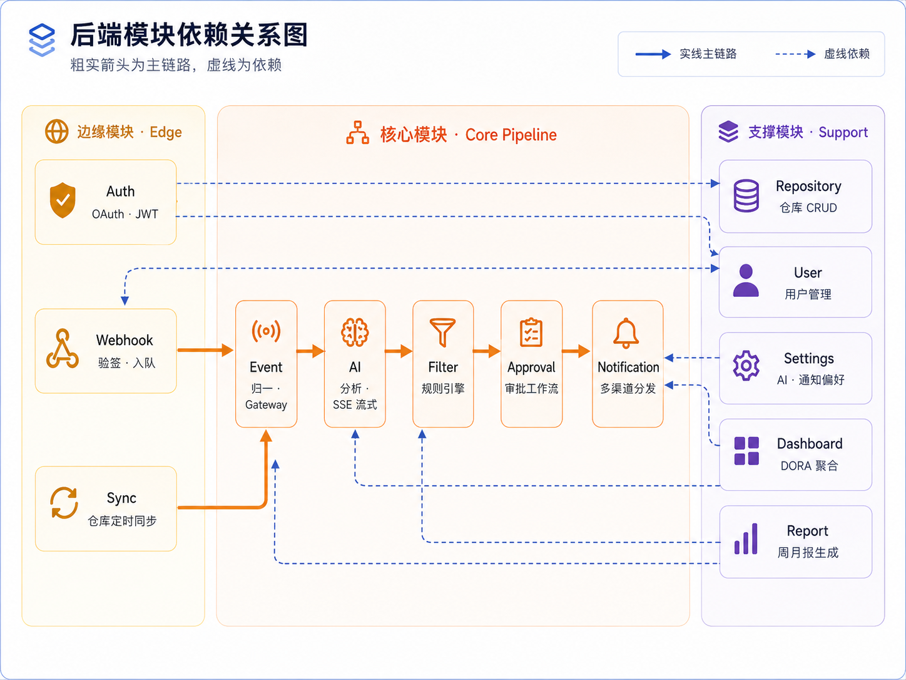

<p align="center">图 5-2 · 后端模块依赖示意图（粗实箭头为主链路，虚线为依赖）</p>

### 5.7 前端组件树示意图

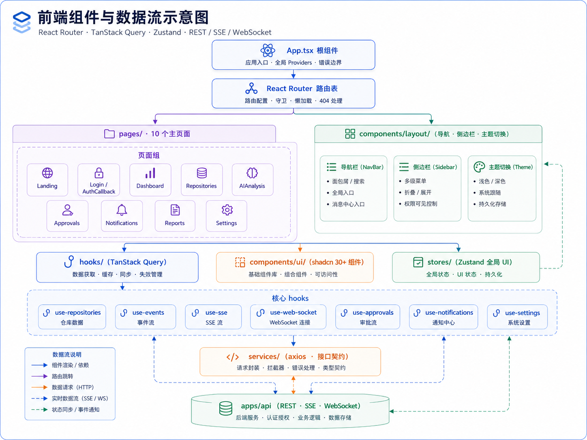

<p align="center">图 5-3 · 前端组件与数据流示意图</p>

---

## 6. 可靠性与安全性设计

### 6.1 可靠性指标（SLO）

围绕 Webhook、AI 与灾难恢复建立可量化指标：

| 维度 | 目标 | 实现手段 |
| :--- | :--- | :--- |
| Webhook 入队 | 95% 事件 ≤ 2 秒 | 验签后立即入 BullMQ 队列，业务逻辑全部异步 |
| CRITICAL 级通知 | ≤ 1 秒触发 | 优先级队列与 WebSocket 推送 |
| AI 摘要首帧 | 常规 PR ≤ 10 秒；大 diff（>1K 行）≤ 15 秒 | SSE 流式输出，先返摘要后补全 |
| 单 PR 查询 | ≤ 200 ms | 复合索引与 Prisma 查询优化 |
| 灾难恢复 | RTO ≤ 1 小时；RPO ≤ 15 分钟 | 日全量备份与关键表实时备份 |
| AI 任务重试 | 最多 3 次，超过转人工 | 指数退避 1s / 4s / 16s |

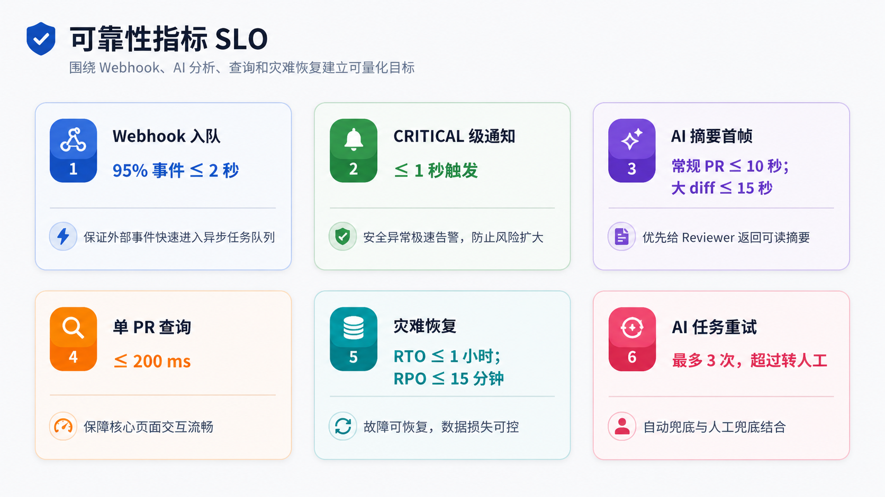

<p align="center">图 6-1 · 可靠性指标 SLO 总览</p>

### 6.2 三层兜底安全架构

| 层 | 维度 | 核心措施 |
| :--- | :--- | :--- |
| 接口层 | Webhook 完整性 | 基于原始 Body 做 HMAC-SHA256 校验；按仓库粒度获取 Secret；失败入审计后丢弃 |
| 接口层 | 鉴权 | JWT 存于 HttpOnly Cookie，前端不可读，防 XSS |
| 接口层 | 授权 | RBAC 四级角色：ADMIN / MANAGER / MEMBER / VIEWER |
| 接口层 | 传输安全 | 全站 HTTPS；内部服务通信启用 JWT 鉴权 |
| 接口层 | 速率限制 | 失败重试入审计，防暴力破解 |
| 行为层 | AI Sandbox | AI 分析跑在受限容器，防止恶意 Prompt 或代码扩散 |
| 行为层 | 操作审计 | 关键动作（登录、Webhook 失败、AI 调用、审批）写入 `AuditLog` |
| 行为层 | 应急响应 | CRITICAL 级异常 5 分钟内通知负责人，自动触发隔离 playbook |
| 数据层 | 凭据加密 | GitHub / GitLab Token、AI API Key 采用 AES-256 加密落库 |
| 数据层 | 审计日志表 | 失败验签与操作记录持久化存储 |
| 数据层 | 备份策略 | RTO ≤ 1h，RPO ≤ 15min |

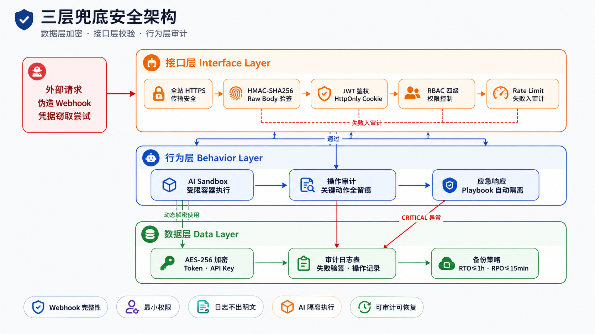

<p align="center">图 6-2 · 三层兜底安全示意图（按攻击路径自上而下）</p>

### 6.3 AI 容错与降级链路

链路顺序如下：

1. 主 Provider（用户在 Settings 中配置），成功则直接返回。
2. 指数退避重试（1s → 4s → 16s，最多 3 次），用于短时抖动恢复。
3. 备选 Provider（平台默认 Fallback，如 Claude 切 GPT），主模型长时不可用时自动切换。
4. Reviewer 人工兜底（标记 FAILED 并进入审批队列），全自动链路彻底失败时保证业务不中断。

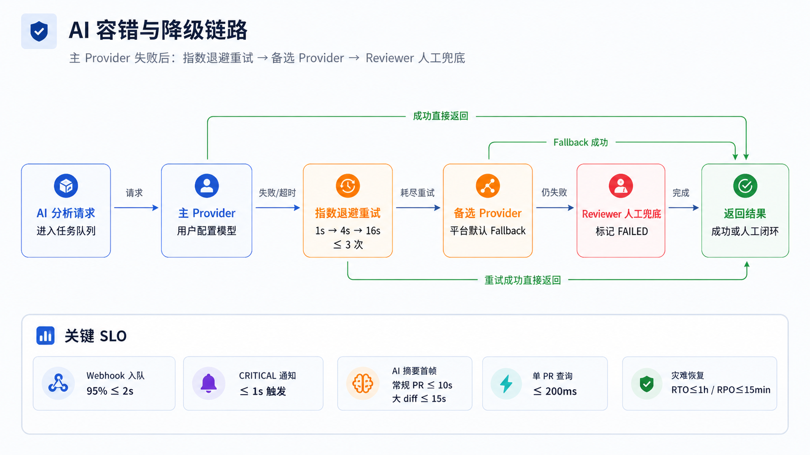

<p align="center">图 6-3 · AI 容错与降级链路示意图</p>

### 6.4 关键设计权衡

| 选择 | 理由 |
| :--- | :--- |
| HttpOnly Cookie 而非 LocalStorage | 防 XSS：JS 不可访问 Cookie，避免 Token 被前端脚本窃取 |
| HMAC 基于 Raw Body 而非 JSON.parse 后 | 中间任何反序列化都会破坏签名；NestJS 中通过 `rawBody: true` 配置 |
| 异步队列而非同步处理 | 满足 GitHub Webhook 10 秒超时；AI 调用可达 30 秒 |
| RBAC 4 级而非 2 级 | 满足 SaaS 多租户与团队内部角色分层需求 |

---

## 7. 项目文档体系

### 7.1 文档站点

文档采用 Mintlify 框架，提供搜索、版本切换、深色模式与移动端适配。

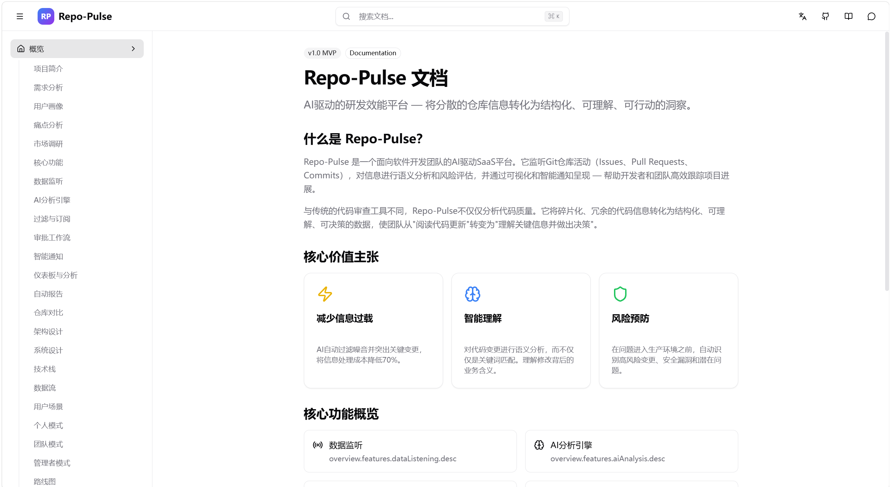

<p align="center">图 7-1 · 项目文档站点首页（v1.0 MVP）</p>

### 7.2 文档体系与工程规范

文档清单覆盖契约、计划、需求、设计、规范、测试、AI、周报八类，并配套微步开发流程与多条工程红线，保障代码与文档同步演进。

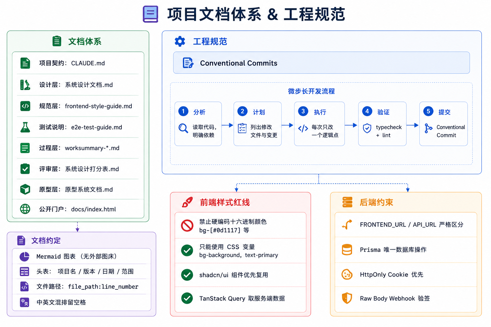

<p align="center">图 7-2 · 项目文档体系与工程规范</p>

### 7.3 文档清单

| 类别 | 文档 | 路径 | 说明 |
| :--- | :--- | :--- | :--- |
| 顶层契约 | CLAUDE.md | `/CLAUDE.md` | Claude Code 执行契约（微步长、验证、提交规范） |
| 项目计划 | 项目计划书 | `docs/project-plan-book.md` | 范围、过程、规模、资源、交付、计划、风险 |
| 需求规格 | SRS | `docs/requirements/srs.md` | 用例、数据流、类、状态、CRC、安全、性能、UI |
| 系统设计 | 系统设计书（本文档） | `docs/system-design/system-design-book.md` | 七章设计 + 15 张配套示意图 |
| 前端规范 | 前端样式规范 | `docs/frontend-style-guide.md` | 75+ 规则，含样式红线（禁用硬编码颜色） |
| 测试指南 | E2E 测试指南 | `docs/e2e-test-guide.md` | 测试用例、模拟数据、覆盖率 |
| AI 设计 | AI 分析设计 | `docs/AI-analysis.md` | AI Provider 抽象层、Prompt 模板 |
| 周报 | 前端周工作总结 | `docs/frontend-worksummary-*.md` | 按周归档 |

### 7.4 微步开发流程

CLAUDE.md 中定义的微步长原则，确保 AI 辅助开发可控：

1. 分析阶段：读取相关代码文件，明确依赖关系。
2. 计划阶段：列出具体要修改的文件与预期变更。
3. 执行阶段：每次只修改一个逻辑相关的功能点。
4. 验证阶段：运行 `pnpm typecheck` 与 `pnpm lint`。
5. 提交阶段：使用 Conventional Commits 规范 git commit。

### 7.5 工程红线

| 类别 | 红线 |
| :--- | :--- |
| 前端样式 | 禁用硬编码颜色（如 `bg-[#0d1117]`）；只能使用 `frontend-style-guide.md` 中定义的 CSS 变量 |
| 服务端数据 | 必须使用 TanStack Query；严禁 `useEffect` + `useState` 拉取数据 |
| 类型安全 | 前后端 Payload 必须从 `@repo-pulse/shared` 导入；严禁 `any` |
| 后端配置 | 明确分离 `FRONTEND_URL` 与 `API_URL`；OAuth 回调与前端链接必须使用 `FRONTEND_URL` |
| Webhook | 必须基于 Raw Body 验签，按仓库粒度获取 Secret |
| 数据库 | 必须通过 Prisma Client；schema 变更后必须运行 `pnpm db:generate` 与 `pnpm db:migrate` |

### 7.6 文档质量保证

- 版本控制：所有文档在 git 中跟踪，提交遵循 Conventional Commits。
- 图表规范：所有图均有图号与图注，正文引用图号。
- 术语统一：缩写首次出现给出全称；专有名词使用一致的中英文翻译。
- 可执行性：所有命令片段（`pnpm xxx`、`docker compose up`）均经过实测。
- 同步更新：代码变更（Prisma schema、模块结构）触发文档评审。

---

## 术语与缩写表

| 缩写 | 全称 | 说明 |
| :--- | :--- | :--- |
| SaaS | Software as a Service | 软件即服务 |
| LLM | Large Language Model | 大语言模型 |
| SSE | Server-Sent Events | 服务器推送事件，单向流式 |
| WS | WebSocket | 双向实时通信协议 |
| OAuth | Open Authorization | 开放授权协议 |
| JWT | JSON Web Token | 基于 JSON 的令牌 |
| RBAC | Role-Based Access Control | 基于角色的访问控制 |
| HMAC | Hash-based Message Authentication Code | 基于哈希的消息认证码 |
| CRUD | Create / Read / Update / Delete | 增删改查 |
| DORA | DevOps Research and Assessment | 四大效能指标 |
| ORM | Object-Relational Mapping | 对象关系映射 |
| PR | Pull Request | 合并请求 |
| SLO | Service Level Objective | 服务等级目标 |
| RTO | Recovery Time Objective | 恢复时间目标 |
| RPO | Recovery Point Objective | 恢复点目标 |
| BE / FE | Backend / Frontend | 后端 / 前端 |
| QA | Quality Assurance | 测试 |
| MVP | Minimum Viable Product | 最小可行产品 |
| WBS | Work Breakdown Structure | 工作分解结构 |
| CRC | Class-Responsibility-Collaborator | 类 - 职责 - 协作者卡片 |
| DFD | Data Flow Diagram | 数据流图 |
| E-R | Entity-Relationship | 实体关系 |
