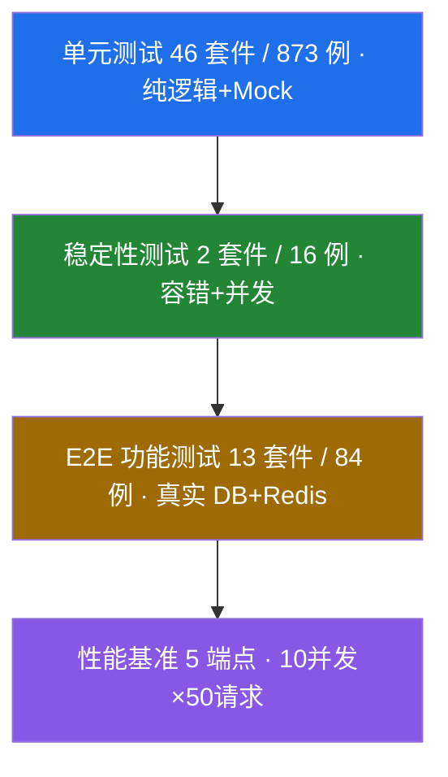
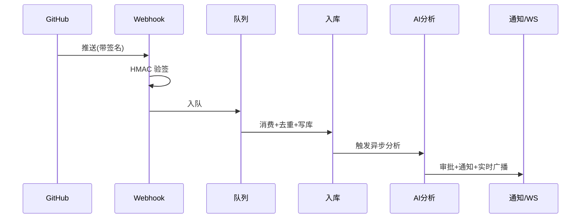
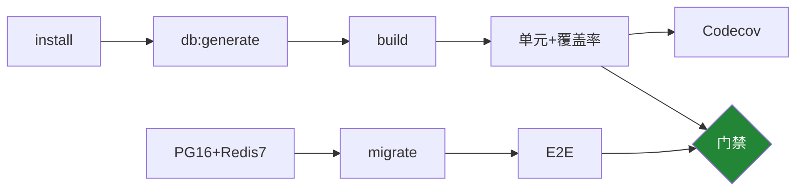

<!--
本文件用于「投喂 AI 生成 PPT」。使用说明：
- 每个一级/二级标题 + 其下内容 = 一页幻灯片，页间以 --- 分隔。
- 生成建议：科技风/深色商务主题；要点精炼、突出大数字；图表可保留 mermaid 或转为示意图。
- 演讲对象：课程答辩 / 项目验收，时长约 8-10 分钟。
- 所有数据均为 2026-06-08 在真实环境（PostgreSQL 16 + Redis 7）的实测结果。
-->

# Repo-Pulse 系统测试汇报

### AI 驱动代码仓库监控平台 · 测试与质量保障

汇报人：yhyhyhy　|　分支：release/acceptance　|　2026-06

---

## 目录

1. 项目与测试目标
2. 测试体系分层
3. 测试执行总览
4. 单元测试与覆盖率
5. 功能测试（E2E）
6. 性能测试
7. 稳定性测试
8. 缺陷管理
9. CI/CD 自动化
10. 打分汇总与结论

---

## 一、项目与测试目标

**Repo-Pulse**：AI 驱动的代码仓库监控与管理平台（Monorepo）

- 前端 React 19 + TypeScript，后端 NestJS + Prisma + PostgreSQL + Redis
- 核心链路：Webhook 接入 → 队列消费 → 入库 → AI 分析 → 审批 → 多渠道通知 → 实时推送

**测试目标**

- 保证核心业务链路端到端正确
- 依赖服务故障时主链路不崩溃
- 关键接口性能满足 SLA
- 用覆盖率与 CI 门禁防止质量回退

---

## 二、测试体系分层

四层测试金字塔，从快到慢、从局部到全局：

底层多而快、顶层少而真，结构规范。

---

## 三、测试执行总览

| 测试类型 | 套件 | 用例 | 通过 | 跳过 | 失败 |
|---------|:---:|:---:|:---:|:---:|:---:|
| 单元 + 稳定性 | 48 | 889 | 889 | 0 | 0 |
| 功能测试 E2E | 13 | 84 | 83 | 1 | 0 |
| 性能基准 | 1 | 5 端点 | 5 | 0 | 0 |

**全部在真实环境实测，结果可复现**

- 单元 + 稳定性：889 / 889 全绿
- E2E：83 通过 + 1 跳过（已记录的授权缺陷）
- 性能：5 / 5 端点满足 SLA

---

## 四、单元测试与覆盖率

**46 个单元套件，覆盖 15+ 业务模块**：认证、事件、AI 分析、仓库、过滤规则、通知、IM、审批、Webhook、仪表板……

**覆盖率（Jest + Codecov 实测）**

| 行 | 语句 | 函数 | 分支 |
|:---:|:---:|:---:|:---:|
| 66.18% | 65.74% | 64.35% | 52.08% |

亮点：健康规则、关键节点检测等纯逻辑模块行覆盖 92%–99%，规则分支全覆盖。

---

## 五、功能测试（E2E）

**真实 NestJS 实例 + PostgreSQL 16 + Redis 7，supertest 发真实 HTTP 请求**

端到端核心链路：

13 套件覆盖：登录鉴权、Webhook 验签、仓库同步、AI 审批流、过滤规则、仪表板、WebSocket 实时。

---

## 六、性能测试

**10 并发 × 50 请求/端点，统计 QPS 与 P50/P95/P99**

| 端点 | QPS | P50 | P99 | 错误率 |
|------|:---:|:---:|:---:|:---:|
| dashboard/overview | 318 | 27ms | 41ms | 0% |
| events 列表 | 258 | 27ms | 80ms | 0% |
| repositories | 235 | 30ms | 91ms | 0% |
| dashboard/activity | 254 | 18ms | 23ms | 0% |
| notifications/preferences | 309 | 29ms | 39ms | 0% |

**所有端点 P99 在 23–91ms，远低于 2000ms SLA，错误率 0%**

---

## 七、稳定性测试

核心原则：后置服务故障不得影响主链路；并发不串扰、不崩溃。

**容错降级（8 例全通过）**
- WebSocket / AI / 通知 / IM 单点故障 → 事件仍正常入库
- AI 超时不阻塞主链路
- WebSocket + 通知级联故障 → 核心事件仍入库

**并发安全（8 例全通过）**
- 10 并发不同事件全部成功、无串扰
- 单次创建 <200ms，串行均值 <100ms
- 空 body / 超长字段不崩溃

---

## 八、缺陷管理

**测试中真实定位到一个高危缺陷（体现测试有效性）**

> **D-01（High）**：`/sync` 接口异步化后，端点与 worker 均缺少编辑权限校验，只读用户可触发实际同步（授权回归）。
> 对应 E2E 用例已显式标注，待修复后恢复断言。

**治理体系**
- CHANGELOG（Keep a Changelog 规范）
- KNOWN_ISSUES「发现→确认→修复→关闭」五步生命周期
- Conventional Commits 保证提交可追溯

---

## 九、CI/CD 自动化

三 Job 结构：构建+单元 / 真实库 E2E / 门禁（双绿才放行）。
覆盖率阈值由 Jest 强制，Codecov 持续跟踪。

---

## 十、打分汇总

| 维度 | 满分 | 得分 |
|------|:---:|:---:|
| 单元测试 | 20 | 18 |
| 功能测试 E2E | 20 | 19 |
| 性能测试 | 10 | 10 |
| 稳定性测试 | 10 | 9 |
| 测试总结报告 | 10 | 10 |
| 缺陷管理 | 20 | 19 |
| 其他（CI/CD） | 10 | 9 |
| **合计** | **100** | **94** |

---

## 结论

**优点**
- 全部测试真实可执行、结果可复现
- E2E 覆盖完整业务链路
- 稳定性测试验证依赖故障下主链路不崩溃
- 测试真实发现高危缺陷，质量管理诚实透明

**改进方向**
- 修复 D-01 授权缺陷
- 提升分支覆盖率（当前 52%）
- 补齐 controller / 新模块单元测试
- 生产级数据量下重建性能基线

---

## 谢谢观看

### Q & A

Repo-Pulse 测试与质量保障汇报
