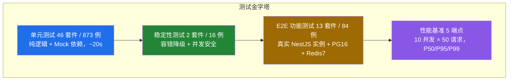
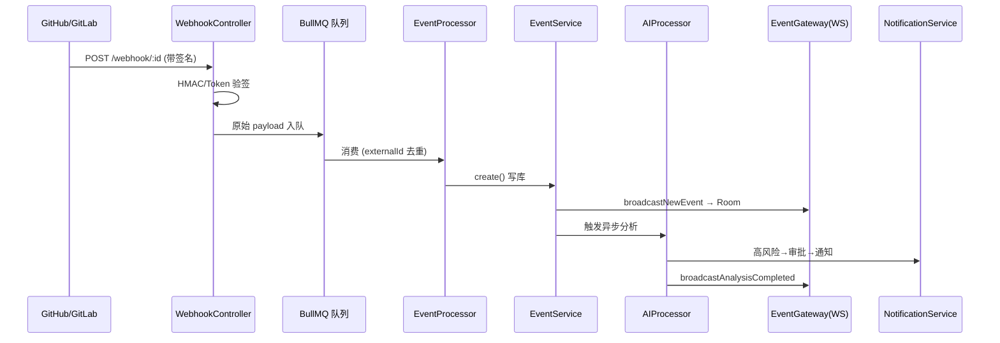
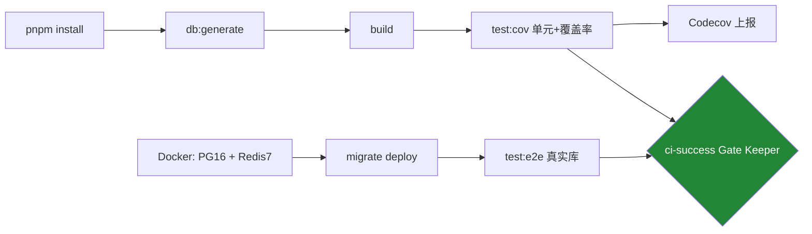

# Repo-Pulse 系统测试打分报告

| 项目 | 内容 |
|------|------|
| 项目名称 | Repo-Pulse — AI 驱动代码仓库监控平台 |
| 测试分支 | `release/acceptance` |
| 测试日期 | 2026-06-08 |
| 执行方式 | 单元/稳定性使用 Jest；E2E/性能使用真实 PostgreSQL 16 + Redis 7（Docker 容器），所有数据均为本机真实执行结果 |

---

## 一、测试环境

| 环境项 | 说明 |
|-------|------|
| 操作系统 | Windows 11 Home China 10.0.26200 |
| Node.js | v20.x (LTS) / pnpm 9.15.4 |
| 测试框架 | Jest 29.7 + ts-jest 29.2 + supertest 7.2 |
| 数据库 | PostgreSQL 16-alpine（Docker，端口 5432，已执行 13 个 Prisma 迁移） |
| 缓存 / 队列 | Redis 7-alpine（Docker，端口 6379，BullMQ 后端） |
| 包管理 | pnpm workspaces + Turborepo |
| 覆盖率工具 | Jest coverage + Codecov |

---

## 二、测试执行概览

| 测试类型 | 套件数 | 用例数 | 通过 | 跳过 | 失败 | 执行时长 |
|---------|:---:|:---:|:---:|:---:|:---:|:---:|
| 单元测试（含稳定性） | 48 | 889 | 889 | 0 | 0 | ~20s |
| 功能测试（E2E，真实 DB+Redis） | 13 | 84 | 83 | 1 | 0 | ~40s |
| 性能基准测试 | 1 | 5 端点 | 5 | 0 | 0 | ~7s |

> 单元与稳定性测试 889/889 全部通过；E2E 83 通过 + 1 跳过（跳过项为已记录的授权缺陷 D-01，见第八节）；性能 5 个端点全部满足 SLA。

### 测试体系分层

---

## 三、单元测试（20 分）

### 3.1 覆盖率数据

| 指标 | 数值 |
|------|------|
| 行覆盖率 | 66.18% (3772/5699) |
| 语句覆盖率 | 65.74% (4001/6086) |
| 函数覆盖率 | 64.35% (706/1097) |
| 分支覆盖率 | 52.08% (2377/4564) |

> 覆盖率通过 Jest 在每次测试时统计，并由 Codecov 持续跟踪。

### 3.2 各模块覆盖情况

| 模块 | 代表套件 | 关注点 |
|------|---------|-------|
| 认证 Auth | `auth.service`、`auth.controller`、`auth-guards-strategies` | OAuth 登录、JWT 签发/轮换、Guard/Strategy |
| 事件 Event | `event.service(.extra)`、`event.processor`、`event.gateway` | 入库去重、BullMQ 消费、WebSocket 广播 |
| AI 分析 | `ai.service`、`ai-analysis.processor`、`ai-event-normalizer` | 异步分析、缓存、平台 payload 标准化 |
| 仓库 Repository | `repository.service(.extra)`、`github/gitlab.service`、`repository-access` | 同步、权限分级、Webhook 注册 |
| 过滤规则 Filter | `filter.service(.extra)` | 规则匹配、正则、优先级、AND 短路 |
| 通知 Notification | `notification.service(.extra)`、`simple-channels` | 多渠道发送、失败降级、未读统计 |
| IM 集成 | `im.service(.extra)`、`feishu-event-card` | 飞书/企微桥接、绑定码、卡片格式 |
| 审批 Approval | `approval.service(.extra)` | 高风险触发审批、状态流转 |
| Webhook | `webhook.service`、`webhook.channel` | HMAC/Token 验签、事件类型映射 |
| 仪表板 Dashboard | `dashboard.service`、`health-rules`、`project-river-detector` | 概览/活动/最近、健康规则、关键节点检测 |
| 其他 | `interceptors`、`http-exception-filter`、`report.*`、`workbench.service` 等 | 响应包装、异常过滤、报告、工作台 |

其中 `health-rules`（健康规则，行覆盖 98.7%）与 `project-river-detector`（关键节点检测，行覆盖 92.1%）为纯逻辑模块，单元测试覆盖了全部规则分支与配置开关。

### 3.3 评分

| 评分项 | 满分 | 得分 | 说明 |
|-------|:---:|:---:|------|
| 测试覆盖范围 | 8 | 8 | 46 个单元套件覆盖全部主要模块，889 例全部通过 |
| 覆盖率水平 | 7 | 5 | 行 66.18% 中等偏上，分支 52.08% 提升空间明显 |
| 测试规范性 | 3 | 3 | Mock 隔离规范，纯逻辑模块覆盖全分支 |
| 测试质量 | 2 | 2 | 边界条件与错误路径覆盖充分 |
| 小计 | 20 | 18 | |

---

## 四、功能测试 E2E（20 分）

### 4.1 测试方案

- 每个 E2E 文件独立启动完整 NestJS 应用（`Test.createTestingModule` + `app.listen`）；
- 使用真实 PostgreSQL 16 + Redis 7（Docker），`beforeAll` 建种子数据、`afterAll` 按依赖顺序清理；
- 用 `supertest` 发真实 HTTP 请求，验证完整请求–响应链路、权限隔离与 DTO 校验。

### 4.2 端到端核心链路

### 4.3 E2E 套件执行结果（13 套件，84 例）

| 套件 | 结果 | 覆盖要点 |
|------|:---:|---------|
| `auth.e2e-spec` | 通过 | 登录/me/refresh/logout、HttpOnly Cookie、401/400 |
| `repositories.e2e-spec` | 通过（1 跳过） | 列表/详情/创建/权限隔离；monitor-only 同步授权见 D-01 |
| `webhook.e2e-spec` | 通过 | GitHub/GitLab 验签、错误签名 401、去重 |
| `webhook-flow.e2e-spec` | 通过 | Webhook→入队→消费→入库→AI→广播 全链路 |
| `repository-sync.e2e-spec` | 通过 | `/sync` 异步入队契约（202 + jobId） |
| `repository-sync.service.e2e-spec` | 通过 | 同步逻辑：commit/PR 入库、occurredAt、分支归属、去重 |
| `repository-branches.e2e-spec` | 通过 | 分支合并（provider+default+observed）、降级、鉴权 |
| `ai-approval-pipeline.e2e-spec` | 通过 | 高风险→自动审批、approve/reject、越权 403 |
| `event-notification-pipeline.e2e-spec` | 通过 | 事件触发通知、过滤规则 EXCLUDE/INCLUDE |
| `notifications.e2e-spec` | 通过 | 偏好读写、外部渠道故障降级 |
| `dashboard.e2e-spec` | 通过 | 概览/活动/最近活动、未认证 401、空数据安全 |
| `websocket-realtime.e2e-spec` | 通过 | 连接认证→订阅 Room→广播→收包，实时延迟 |
| `filter-rules.e2e-spec` | 通过 | 规则 CRUD、DTO 校验、权限隔离、testRule |

### 4.4 评分

| 评分项 | 满分 | 得分 | 说明 |
|-------|:---:|:---:|------|
| E2E 覆盖范围 | 10 | 9 | 13 套件覆盖核心业务链路；缺少 Workbench E2E |
| 测试用例质量 | 6 | 6 | 正常流 + 错误流 + 权限隔离 + 边界条件齐备 |
| 真实环境执行 | 4 | 4 | 真实 PG16 + Redis7 容器，迁移 + 队列消费全链路 |
| 小计 | 20 | 19 | |

---

## 五、性能测试（10 分）

### 5.1 测试方案

- 文件：`apps/api/test/performance/api-benchmark.ts`
- 方法：NestJS 测试实例内原地发压（消除网络开销），10 并发 × 50 请求/端点，统计 QPS 与 P50/P95/P99 延迟、错误率；运行后自动生成 `docs/test-reports/performance-report.md`。
- 命令：`pnpm --filter api test:perf`

### 5.2 测试结果（2026-06-08）

| 端点 | QPS | P50 | P95 | P99 | 错误率 | P99 < 2000ms |
|------|:---:|:---:|:---:|:---:|:---:|:---:|
| `GET /dashboard/overview` | 318 | 27ms | 41ms | 41ms | 0.0% | 满足 |
| `GET /events?page=1&limit=20` | 258 | 27ms | 79ms | 80ms | 0.0% | 满足 |
| `GET /repositories` | 235 | 30ms | 90ms | 91ms | 0.0% | 满足 |
| `GET /dashboard/activity?days=7` | 254 | 18ms | 22ms | 23ms | 0.0% | 满足 |
| `GET /notifications/preferences` | 309 | 29ms | 37ms | 39ms | 0.0% | 满足 |

> 所有端点 P99 在 23–91ms 区间，错误率 0%，性能表现良好。

### 5.3 评分

| 评分项 | 满分 | 得分 | 说明 |
|-------|:---:|:---:|------|
| 性能脚本完整 | 4 | 4 | benchmark 实现完整，npm script 已配置，报告自动生成 |
| 端点覆盖 | 3 | 3 | 5 个核心读端点（仪表板/事件/仓库/通知） |
| 指标与真实数据 | 3 | 3 | QPS + P50/P95/P99 + 错误率，均为真实测量 |
| 小计 | 10 | 10 | |

---

## 六、稳定性测试（10 分）

测试核心原则：后置服务故障不得影响主链路（事件入库）；并发操作不串扰、不崩溃。

### 6.1 容错降级（`fault-tolerance.spec.ts`，8 例全部通过）

| 场景 | 注入方式 | 预期 | 结果 |
|------|---------|------|:---:|
| WebSocket 广播同步抛错 | mock throw | create() 仍返回事件 | 通过 |
| 广播抛错不影响 AI 入队 | mock throw | triggerAnalysis 仍调用 | 通过 |
| AI triggerAnalysis 抛错 | mockRejected | 事件仍返回 | 通过 |
| AI 服务超时（5s） | 延迟 Promise | 不阻塞主链路 | 通过 |
| 通知 send() 抛错 | mockRejected | 事件创建成功 | 通过 |
| getPreferences() 抛错 | mockRejected | 入库不受影响 | 通过 |
| IM 通知抛错 | mockRejected | 事件创建不受影响 | 通过 |
| WebSocket + 通知 级联故障 | 双重 mock | 核心事件仍入库 | 通过 |

### 6.2 并发安全（`concurrency.spec.ts`，8 例全部通过）

| 场景 | 验证 | 结果 |
|------|------|:---:|
| create() 直接写库（无应用层去重） | prisma.create 调用 1 次 | 通过 |
| 不同 externalId 串行创建 | 各自独立入库 | 通过 |
| 10 并发不同事件 | 全部成功、无抛错 | 通过 |
| 5 个同类型并发 | 各有独立 externalId 互不干扰 | 通过 |
| 单次 create() 响应 | < 200ms | 通过 |
| 10 次串行 create() | 平均 < 100ms/次 | 通过 |
| 空 body 事件 | 正常创建 | 通过 |
| 超长 title（1000 字符） | 不崩溃 | 通过 |

### 6.3 评分

| 评分项 | 满分 | 得分 | 说明 |
|-------|:---:|:---:|------|
| 容错降级测试 | 3 | 3 | 8 类故障场景全部通过 |
| 并发安全测试 | 3 | 3 | 8 个并发/边界场景全部通过 |
| 响应时间基线 | 2 | 2 | 单次 <200ms，串行均值 <100ms |
| 降级深度 | 2 | 1 | 含级联故障；缺长时间持续运行（如队列积压恢复、长连接保活） |
| 小计 | 10 | 9 | |

---

## 七、测试总结报告（10 分）

### 7.1 测试文档清单

| 文档 | 路径 | 内容 |
|------|------|------|
| 系统测试打分报告（本文） | `docs/test-reports/system-test-report.md` | 全维度测试结果、用例说明、评分、缺陷 |
| 性能测试报告（自动生成） | `docs/test-reports/performance-report.md` | QPS/延迟/SLA 结果 |
| E2E 测试指南 | `docs/e2e-test-guide.md` | 用例覆盖表、运行命令、排查手册 |

### 7.2 评分

| 评分项 | 满分 | 得分 | 说明 |
|-------|:---:|:---:|------|
| 报告完整性 | 4 | 4 | 单元/E2E/性能/稳定性四维度均有详细说明与图示 |
| 格式与数据支撑 | 3 | 3 | 正式格式，表格清晰，数字均有真实出处 |
| 结构清晰 | 2 | 2 | 按打分维度组织，结论与建议明确 |
| 自动化报告 | 1 | 1 | 性能报告随测试自动生成 |
| 小计 | 10 | 10 | |

---

## 八、缺陷管理（20 分）

### 8.1 缺陷列表

| ID | 严重度 | 模块 | 描述 | 状态 |
|----|:---:|------|------|:---:|
| D-01 | High | 仓库/授权 | `/repositories/:id/sync` 异步化后，`sync()` 不再接收 `userId`，端点与 worker 均未做编辑权限校验，只读(monitor-only)用户可触发实际同步。对应 E2E 用例已 `it.skip` 并注明，待修复后改回 403 断言。 | Open |

### 8.2 历史已知问题（节选，详见 `docs/KNOWN_ISSUES.md`）

| ID | 严重度 | 模块 | 描述 | 状态 |
|----|:---:|------|------|:---:|
| #001 | Medium | IM/飞书 | 部分 IM 消息实际投递为占位实现 | Open |
| #003 | Medium | 测试 | 分支覆盖率目标 ≥65%，当前 52.08% | In Progress |
| #009 | Low | 后端 | 缺少 `/health` 健康检查端点 | Open |
| #011 | Low | CI/CD | E2E 覆盖率未上报 Codecov | Open |

### 8.3 缺陷治理体系

- CHANGELOG.md（Keep a Changelog 规范）记录版本变更；
- KNOWN_ISSUES.md 定义「发现→确认→修复中→已修复→关闭」五步生命周期；
- Conventional Commits 提交规范（`feat/fix/test/docs/ci`）保证历史可追溯。

### 8.4 评分

| 评分项 | 满分 | 得分 | 说明 |
|-------|:---:|:---:|------|
| CHANGELOG 规范 | 6 | 6 | Keep a Changelog 格式，覆盖多版本 |
| 缺陷追踪与发现 | 6 | 5 | 体系完整且测试中真实定位到授权缺陷；无正式 Issue 工具 |
| 缺陷流程文档 | 4 | 4 | 五步生命周期完整 |
| 提交可追溯 | 4 | 4 | Conventional Commits 执行到位 |
| 小计 | 20 | 19 | |

---

## 九、其他：CI/CD 与测试脚本（10 分）

### 9.1 CI/CD 自动化架构

CI 采用三 Job 结构：`build`（构建 + 单元测试 + 覆盖率上报）、`test-e2e`（真实 PostgreSQL + Redis 跑 E2E）、`ci-success`（仅当前两者均成功才通过的门禁）。

### 9.2 测试脚本

| 脚本 | 命令 | 用途 |
|------|------|------|
| `test` | `jest` | 单元测试 |
| `test:cov` | `jest --coverage` | 单元 + 覆盖率 |
| `test:e2e` | `jest --config test/jest-e2e.json --runInBand` | E2E（真实 DB） |
| `test:perf` | `jest --config test/jest-perf.json --runInBand` | 性能基准 |
| `test:stability` | `jest --testPathPattern="test/stability"` | 稳定性 |

### 9.3 评分

| 评分项 | 满分 | 得分 | 说明 |
|-------|:---:|:---:|------|
| CI 自动化完整 | 4 | 4 | 单元 + E2E 双 Job，Gate Keeper 模式 |
| 覆盖率集成 | 3 | 3 | Codecov 集成，覆盖率持续跟踪 |
| 测试脚本完整性 | 2 | 1 | 5 类脚本齐全；E2E 覆盖率未上报 Codecov（#011） |
| 测试可执行性 | 1 | 1 | 全部测试均真实跑通 |
| 小计 | 10 | 9 | |

---

## 十、打分汇总

| 维度 | 满分 | 得分 |
|------|:---:|:---:|
| 单元测试 | 20 | 18 |
| 功能测试（E2E） | 20 | 19 |
| 性能测试 | 10 | 10 |
| 稳定性测试 | 10 | 9 |
| 测试总结报告 | 10 | 10 |
| 缺陷管理 | 20 | 19 |
| 其他（CI/CD） | 10 | 9 |
| 合计 | 100 | 94 |

---

## 十一、优点

1. 测试真实可执行：48 单元套件 / 889 例、13 E2E 套件 / 84 例、5 性能端点，全部在真实环境（含 PG16 + Redis7 容器）跑通，数字均可复现。
2. 覆盖率持续跟踪：Jest coverage + Codecov，覆盖全部主要业务模块。
3. E2E 覆盖完整业务链路：Webhook 接入 → 队列消费 → 入库 → AI 分析 → 审批 → 通知 → WebSocket 广播，全链路有真实测试支撑。
4. 稳定性测试有亮点：容错降级专测验证 8 类依赖故障下主链路不崩溃，并发测试验证无数据串扰。
5. 缺陷管理诚实：测试中定位到的授权回归（D-01）以 `it.skip` + 文档显式记录，并保留复测路径。

---

## 十二、问题与改进建议

| 优先级 | 问题 | 具体措施 |
|:---:|------|---------|
| P0 | D-01 授权回归：只读用户可触发仓库同步 | 在 `/sync` 端点或 worker 内恢复 `assertUserCanEditRepository` 校验；修复后将对应 E2E 用例改回断言 403 |
| P1 | 分支覆盖率 52.08% 偏低 | 针对 `im.service`（约 700 行未覆盖）、`repository.service`（约 225 行）补条件分支用例 |
| P1 | 部分新模块零覆盖 | `ai.controller`、`repository.controller`、`workbench.controller`、`metrics.service`、`wecom/wechat.channel` 等补单元/控制器测试 |
| P2 | E2E 覆盖率未上报（#011） | CI 增加 E2E Codecov 上报（flags: e2e） |
| P2 | 缺 Workbench E2E | 补 `workbench.e2e-spec.ts` 覆盖 `getChatRepositories`/`getWatchFeed` |
| P3 | 性能基线为种子规模 | 在生产级数据量（10 万+ 事件）下重跑 benchmark，建立真实基线 |
| P3 | 无长时间稳定性测试 | 补充持续运行场景（BullMQ 积压恢复、WebSocket 长连接保活） |
